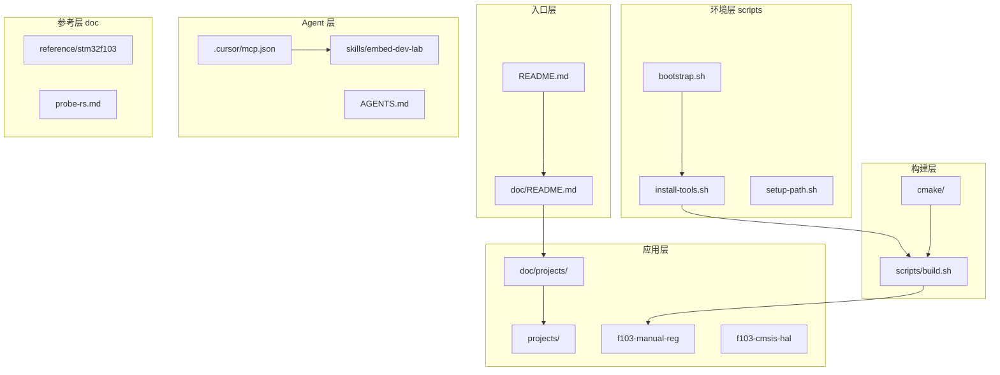

# embed-dev-lab

*Cross-platform embedded lab: CMake + Ninja + ARM GCC + probe-rs*

跨平台嵌入式开发实验框架：**CMake + Ninja + ARM GCC + probe-rs**（主）/ OpenOCD（备选）。  
Demo 目标：**STM32F103C8T6** PC13 LED 闪烁（[`projects/f103-manual-reg`](projects/f103-manual-reg/)）。

**详细文档** → [`doc/README.md`](doc/README.md)

---

## 快速开始

```bash
# 1. 一键：装工具 + 编译 demo（不含烧录）
./scripts/bootstrap.sh

# 2. 确认 ST-Link（Windows 见 doc/probe-rs.md）
probe-rs list

# 3. 编译 + 烧录
./scripts/build.sh f103-manual-reg build && ./scripts/build.sh f103-manual-reg flash
```

完整步骤：[doc/getting-started.md](doc/getting-started.md)

---

## 1. 项目结构与层级

### 1.1 层级架构



| 层级 | 路径 | 职责 |
|------|------|------|
| 入口 | [`README.md`](README.md)、[`doc/`](doc/) | 项目地图与人类文档 |
| 应用 | [`projects/`](projects/)（源码）、[`doc/projects/`](doc/projects/)（说明） | 固件小工程（`f103-manual-reg`、`f103-cmsis-hal` 占位） |
| 构建 | [`cmake/`](cmake/)、[`scripts/build.sh`](scripts/build.sh) | 工具链、MCU 抽象、编译烧录 |
| 环境 | [`scripts/bootstrap.sh`](scripts/bootstrap.sh) 等 | 安装工具、PATH、校验 |
| Agent | [`.cursor/`](.cursor/)、[`skills/`](skills/)、[`AGENTS.md`](AGENTS.md) | MCP、Skill、无 MCP Agent 摘要 |
| 参考 | [`doc/reference/stm32f103/`](doc/reference/stm32f103/) | ST 官方 Datasheet / RM + 精选 MD |

### 1.2 目录树

```text
embed-dev-lab/
├── doc/                            # 使用文档（中文）
│   ├── README.md                   # 文档索引
│   ├── getting-started.md          # 快速上手
│   ├── probe-rs.md                 # probe-rs CLI / ST-Link / WinUSB
│   ├── ide-debug.md                # IDE 扩展与调试
│   ├── scripts-reference.md        # 脚本说明与自动化链路
│   ├── mcp-skills.md               # MCP 与 Skill 安装
│   ├── projects/                   # 应用层固件说明（与 projects/<name>/ 对应）
│   │   ├── README.md
│   │   ├── f103-manual-reg.md
│   │   └── f103-cmsis-hal.md
│   ├── modules-f103-blink.md       # 重定向 stub → projects/f103-manual-reg.md
│   ├── learn/                      # 学习笔记（CMSIS、编译流程、NVIC 等）
│   └── reference/stm32f103/        # ST 官方 PDF + 精选 MD
├── scripts/                        # 安装、PATH、构建、校验
│   ├── bootstrap.sh                # 一键环境 + 编译
│   ├── build.sh                    # 模块 configure / build / flash
│   ├── build-flash.sh              # 一键 build + flash
│   ├── install-tools.sh            # 分 OS 安装入口
│   ├── install-mcp-skills.sh       # embedded-debugger MCP + Skill
│   ├── fetch-stm32f103-docs.sh     # 下载 DS5319 + RM0008 PDF
│   ├── fetch-cmsis.sh              # 初始化 cmsis-core + cmsis-device-f1 submodule
│   ├── fetch-cmsis-core.sh         # 兼容别名 → fetch-cmsis.sh
│   ├── fetch-stm32cubef1.sh        # 获取 STM32CubeF1 固件包
│   ├── env-check.sh                # 工具链与扩展校验
│   ├── setup-path.sh               # User PATH + bashrc
│   ├── setup-clangd.sh             # compile_commands + clangd
│   ├── install-extensions.sh       # 安装 .vscode/extensions.json
│   ├── install/                    # windows | linux | macos | stlink-winusb
│   └── lib/                        # 公共 shell 库
├── cmake/
│   ├── toolchain-arm-none-eabi.cmake
│   └── mcu-config.cmake            # embed_mcu_add_executable()
├── projects/
│   ├── README.md                   # 固件小工程索引
│   ├── f103-manual-reg/            # 全手写寄存器 PC13 闪烁
│   │   ├── src/
│   │   ├── startup/
│   │   └── linker/
│   └── f103-cmsis-hal/             # CMSIS+HAL 占位（仅 README）
├── skills/
│   └── embed-dev-lab/SKILL.md      # 项目 Skill 源文件（可提交）
├── .cursor/
│   ├── mcp.json                    # embedded-debugger MCP 配置
│   └── skills/embed-dev-lab/       # Cursor Skill 注册
├── .vscode/                        # launch.json / tasks.json / extensions.json
├── AGENTS.md                       # Codex 等无 MCP Agent 的 Skill 摘要
├── .gitmodules                     # cmsis-core / cmsis-device-f1 submodule
├── vendor-pack/                    # ST-Link 驱动、CMSIS submodules、CubeF1 fetch
│   ├── cmsis-core/                 # CMSIS-Core submodule cm3 / v5.6.0_cm3
│   ├── cmsis-device-f1/            # CMSIS-Device F1 submodule v4.3.5
│   ├── cmsis-core.embed-dev-lab.md
│   ├── cmsis-device-f1.embed-dev-lab.md
│   ├── stm32f1xx-hal-driver.embed-dev-lab.md
│   └── STM32CubeF1/                # F1 全包（fetch，可选）
├── .tools/                         # MCP cargo 构建缓存（gitignore）
├── PROJECT_MEMORY.md               # 维护速查（Agent / 维护者）
└── README.md
```

---

## 2. 脚本说明与手动操作流程

> 脚本全量参考与自动化链路图：[doc/scripts-reference.md](doc/scripts-reference.md)

### 2.1 关键约束

- **Windows**：所有脚本必须在 **Git Bash** 中运行
- **`build.sh flash` 不自动 compile**：改代码后须先 `build` 再 `flash`
- **`bootstrap.sh` 默认不含烧录**；MCP 需 `--with-mcp` 或单独运行 `install-mcp-skills.sh`

### 2.2 入口脚本

| 脚本 | 作用 | 是否烧录 |
|------|------|----------|
| [`bootstrap.sh`](scripts/bootstrap.sh) | 装工具 → PATH → 扩展 → 校验 → 编译 → clangd | 否 |
| [`build.sh`](scripts/build.sh) | 模块 configure / build / flash / clean | 仅 `flash` 动作 |
| [`install-tools.sh`](scripts/install-tools.sh) | 分 OS 安装（windows / linux / macos） | — |
| [`install-mcp-skills.sh`](scripts/install-mcp-skills.sh) | embedded-debugger MCP + 项目 Skill | — |
| [`fetch-stm32f103-docs.sh`](scripts/fetch-stm32f103-docs.sh) | 下载 DS5319 + RM0008 PDF | — |
| [`fetch-cmsis.sh`](scripts/fetch-cmsis.sh) | 初始化 `cmsis-core` + `cmsis-device-f1` submodule | — |
| [`fetch-cmsis-core.sh`](scripts/fetch-cmsis-core.sh) | 同上（兼容别名） | — |
| [`fetch-stm32cubef1.sh`](scripts/fetch-stm32cubef1.sh) | 获取 STM32CubeF1 至 `vendor-pack/STM32CubeF1/` | — |

**bootstrap 常用参数：**

```bash
./scripts/bootstrap.sh --build-only          # 跳过安装，仅编译
./scripts/bootstrap.sh --install-only        # 只安装，不编译
./scripts/bootstrap.sh --skip-extensions     # 不装 IDE 扩展
./scripts/bootstrap.sh --with-mcp            # 额外安装 MCP + Skill
./scripts/bootstrap.sh --module f103-manual-reg   # 指定模块（默认 f103-manual-reg）
```

**build.sh 动作：**

```bash
./scripts/build.sh f103-manual-reg              # configure + build（默认 all）
./scripts/build.sh f103-manual-reg build
./scripts/build.sh f103-manual-reg flash        # probe-rs download + reset
./scripts/build.sh f103-manual-reg flash-openocd
./scripts/build.sh f103-manual-reg clean
```

### 2.3 辅助脚本

| 脚本 | 典型用途 |
|------|----------|
| [`env-check.sh`](scripts/env-check.sh) | 校验 cmake / ninja / gcc / clangd / probe-rs / 扩展 / probe |
| [`setup-path.sh`](scripts/setup-path.sh) | 写入 User PATH + `~/.bashrc` embed-dev-lab 块 |
| [`setup-clangd.sh`](scripts/setup-clangd.sh) | 同步 `compile_commands.json`、写 clangd 配置 |
| [`install-extensions.sh`](scripts/install-extensions.sh) | 安装 [`.vscode/extensions.json`](.vscode/extensions.json) 扩展 |
| [`install/stlink-winusb-windows.sh`](scripts/install/stlink-winusb-windows.sh) | Windows ST-Link WinUSB（`--check-only` / `--install`） |

### 2.4 常见手动流程

| 场景 | 适用何时 | 命令 |
|------|----------|------|
| **A. 首次搭建** | 新克隆仓库，从零到 LED | 见下方 A |
| **B. 日常开发** | 改代码后编译并烧录（最常用） | 见下方 B |
| **C. 只编译** | 工具已装好，不需安装/烧录 | 见下方 C |
| **D. 只烧录** | ELF 已存在，未改代码 | 见下方 D |
| **E. 排错** | probe 不可见、IDE 找不到工具 | 见下方 E |
| **F. 文档与 Agent** | 拉官方 PDF 或启用 MCP | 见下方 F |

**A. 首次搭建（从零到 LED）**

```bash
./scripts/bootstrap.sh
./scripts/install/stlink-winusb-windows.sh --check-only   # Windows
probe-rs list
./scripts/build.sh f103-manual-reg build
./scripts/build.sh f103-manual-reg flash
```

→ 接线与验证：[doc/getting-started.md](doc/getting-started.md)

**B. 日常改代码 → 烧录**

```bash
./scripts/build.sh f103-manual-reg build && ./scripts/build.sh f103-manual-reg flash
```

**C. 工具已装好，只编译**

```bash
./scripts/bootstrap.sh --build-only --skip-extensions
# 或
./scripts/build.sh f103-manual-reg build
```

**D. 仅烧录已有 ELF**

```bash
./scripts/build.sh f103-manual-reg flash
```

**E. 环境 / 驱动排错**

```bash
./scripts/env-check.sh
./scripts/setup-path.sh          # IDE 找不到工具时，执行后重启 Cursor
probe-rs list
```

**F. 可选：官方文档 + Agent 能力**

```bash
./scripts/fetch-stm32f103-docs.sh --verify-only
./scripts/install-mcp-skills.sh --verify-only
./scripts/install-mcp-skills.sh              # 或 bootstrap --with-mcp
```

---

## 3. 构建、编译与调试工具

### 3.1 工具链一览

| 工具 | 角色 | 安装来源 |
|------|------|----------|
| Git Bash | Windows 脚本运行时（**必须**） | 用户自装 |
| CMake ≥ 3.20 + Ninja | 构建系统 | [`install-tools.sh`](scripts/install-tools.sh) |
| arm-none-eabi-gcc | ARM **裸机**交叉编译（非 arm-linux-gnueabihf） | 同上 |
| arm-none-eabi-objcopy | build 后 **ELF→HEX**（POST_BUILD，见 [`mcu-config.cmake`](cmake/mcu-config.cmake)） | 随 gcc 安装 |
| clangd | C LSP / 跳转补全 | 同上；[`setup-clangd.sh`](scripts/setup-clangd.sh) 同步 compile_commands |
| probe-rs | **主** 烧录 + 调试 | 同上 |
| OpenOCD | **备选** 烧录 / 调试 | optional；`flash-openocd` / Cortex-Debug |
| Rust / cargo | 仅 MCP 构建 | [`install-mcp-skills.sh`](scripts/install-mcp-skills.sh) 前置 |
| Cursor / VS Code | IDE | 用户自装 |

| 常量 | 值 |
|------|-----|
| probe-rs chip | `STM32F103C8Tx` |
| CLI 烧录格式 | `--binary-format elf`（勿用废弃的 `--format`） |
| ELF 产物 | `projects/f103-manual-reg/build/f103-manual-reg.elf` |
| HEX 产物 | `projects/f103-manual-reg/build/f103-manual-reg.hex`（build 时 objcopy 自动生成） |

### 3.1.1 构建产物与 ELF→HEX

```text
./scripts/build.sh f103-manual-reg build
  → Ninja 链接 → f103-manual-reg.elf
  → POST_BUILD arm-none-eabi-objcopy -O ihex → f103-manual-reg.hex
```

| 烧录方式 | 使用文件 | 入口 |
|----------|----------|------|
| probe-rs（主） | `.elf` | `build.sh flash`、IDE F5 |
| OpenOCD（备选） | `.hex` | `build.sh flash-openocd` |

当前**不生成 `.bin`**。实现位置：[`cmake/mcu-config.cmake`](cmake/mcu-config.cmake) 中 `embed_mcu_add_executable` 的 POST_BUILD。

### 3.2 烧录与调试路径对比

| 方式 | 自动编译 | 自动烧录 | 断点调试 | 入口 |
|------|:--------:|:--------:|:--------:|------|
| CLI `build && flash` | 手动两步 | 是 | 否 | Git Bash |
| Task **Build and Flash F103** | 是 | 是 | 否 | [`.vscode/tasks.json`](.vscode/tasks.json) |
| **F103 Probe-rs Debug**（F5） | 是 | 是 | 是 | [`.vscode/launch.json`](.vscode/launch.json) |
| **embedded-debugger MCP** | Agent 调用 | 可 | 可 | Cursor MCP（需 Connected） |
| **F103 OpenOCD Debug** | preLaunchTask | 是 | 是 | launch 第二配置 |
| `bootstrap.sh` | 是 | 否 | 否 | 一键环境 |

IDE 调试流程：[doc/ide-debug.md](doc/ide-debug.md)

### 3.3 ST-Link / probe-rs（摘要）

Windows 上 probe-rs 需要 ST-Link **Debug** 接口 **WinUSB**：

```bash
./scripts/install/stlink-winusb-windows.sh --check-only
./scripts/install/stlink-winusb-windows.sh --install
probe-rs list
```

驱动包：`vendor-pack/STLink/STLink/USBDriver/`  
完整说明：[doc/probe-rs.md](doc/probe-rs.md)

---

## 4. IDE 插件、MCP 与 Skill

### 4.1 VS Code / Cursor 扩展

来源 [`.vscode/extensions.json`](.vscode/extensions.json)：

| 扩展 ID | 必需 | 作用 |
|---------|------|------|
| `probe-rs.probe-rs-debugger` | 是 | probe-rs 图形调试 + 烧录 |
| `llvm-vs-code-extensions.vscode-clangd` | 是 | C/C++ 语言服务（LSP） |
| `ms-vscode.cmake-tools` | 是 | CMake Presets 集成 |
| `marus25.cortex-debug` | 否 | OpenOCD + Cortex-Debug 备选 |

安装：

```bash
./scripts/install-extensions.sh       # 仅扩展
./scripts/bootstrap.sh                  # 默认包含扩展安装
```

`ms-vscode.cpptools` 在 `unwantedRecommendations` 中（避免与 clangd 冲突）。  
详见 [doc/ide-debug.md](doc/ide-debug.md)。

### 4.2 MCP — embedded-debugger

基于 [embedded-debugger-mcp](https://github.com/Adancurusul/embedded-debugger-mcp) + probe-rs，供 Cursor Agent 调用硬件调试。

| 项 | 内容 |
|----|------|
| Server 名 | `embedded-debugger` |
| 配置 | [`.cursor/mcp.json`](.cursor/mcp.json) |
| 二进制 | `.tools/embedded-debugger-mcp/src/target/release/`（gitignore） |
| 安装 | `./scripts/install-mcp-skills.sh` 或 `bootstrap.sh --with-mcp` |
| 能力 | 22 工具：`list_probes`、`connect`、`reset`、`read_memory`、`write_memory`、`flash_program`、`flash_erase`、`rtt_*` 等 |
| 前置 | probe-rs + Rust/cargo + ST-Link WinUSB |
| Cursor 使用 | MCP 设置页 **Connected** → Reload Window 或新对话后 Agent 可调用 |

```bash
./scripts/install-mcp-skills.sh
./scripts/install-mcp-skills.sh --verify-only
./scripts/install-mcp-skills.sh --global          # 合并到 ~/.cursor 等
```

详见 [doc/mcp-skills.md](doc/mcp-skills.md)。

### 4.3 项目 Skill — embed-dev-lab

| 项 | 内容 |
|----|------|
| 源文件 | [`skills/embed-dev-lab/SKILL.md`](skills/embed-dev-lab/SKILL.md) |
| Cursor 注册 | [`.cursor/skills/embed-dev-lab/`](.cursor/skills/embed-dev-lab/) |
| Codex 等无 MCP | 读 [`AGENTS.md`](AGENTS.md) 摘要 |
| 约束 | 禁止未经确认全片擦除；PC13 Backup 域须 DBP；寄存器对照 RM0008 |

---

## 附录

### 文档索引

| 文档 | 说明 |
|------|------|
| [doc/getting-started.md](doc/getting-started.md) | 从零到 LED 闪烁 |
| [doc/probe-rs.md](doc/probe-rs.md) | probe-rs CLI、驱动、排错 |
| [doc/ide-debug.md](doc/ide-debug.md) | probe-rs-debugger 等扩展 |
| [doc/scripts-reference.md](doc/scripts-reference.md) | 脚本完整参考 |
| [doc/mcp-skills.md](doc/mcp-skills.md) | MCP 与 Skill 安装 |
| [doc/projects/f103-manual-reg.md](doc/projects/f103-manual-reg.md) | F103 demo 模块 |
| [doc/learn/cmsis-overview.md](doc/learn/cmsis-overview.md) | CMSIS 分层、手写兼容边界、与 HAL 关系 |
| [doc/learn/interrupt-vector-table-and-nvic.md](doc/learn/interrupt-vector-table-and-nvic.md) | 中断向量表、NVIC、与 startup 关系 |
| [doc/reference/stm32f103/](doc/reference/stm32f103/) | ST 官方 Datasheet / RM |

### PATH 说明（Windows）

工具写入 **User PATH** 与 Git Bash `~/.bashrc`（`# >>> embed-dev-lab PATH >>>`）。  
Cursor 扩展若找不到工具：运行 `./scripts/setup-path.sh` 并 **重启 Cursor**。

### 新增模块

1. 在 `projects/<name>/` 添加 `CMakeLists.txt`、`CMakePresets.json`、源码  
2. 使用 `embed_mcu_add_executable()`（[`cmake/mcu-config.cmake`](cmake/mcu-config.cmake)）  
3. `./scripts/build.sh <name>`

### License

MIT — see [LICENSE](LICENSE).
