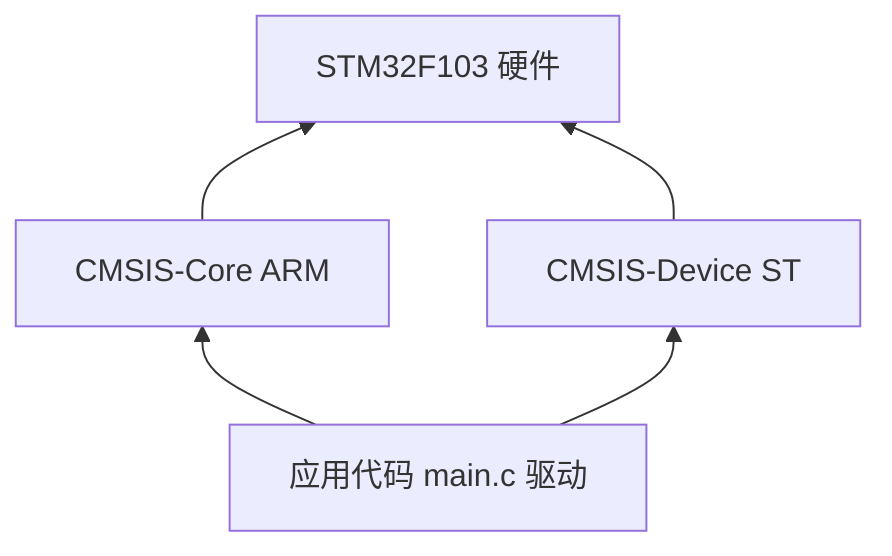
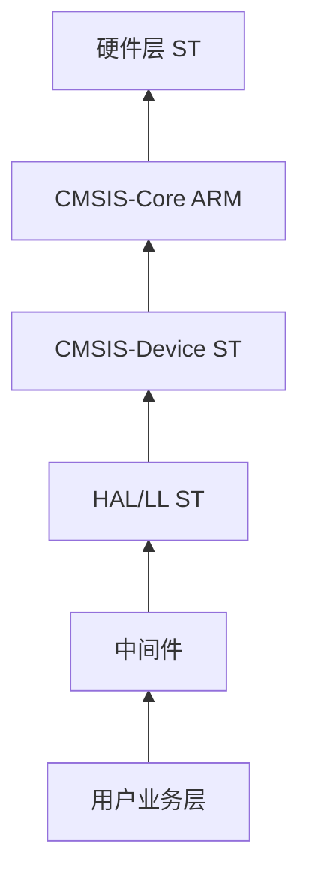

# CMSIS 标准与手写裸机边界

整理自 STM32 生态下 CMSIS 分层、CubeMX 落地、手写代码边界与 HAL 关系的系统梳理。与本仓库 [`f103-blink`](../../modules/f103-blink/) 手写 startup/system 对照阅读。

时钟与 HSE 轮询细节见 [STM32 裸机启动与时钟](stm32-bare-metal-bootstrap.md)；NVIC 与向量表专题见 [中断向量表与 NVIC](interrupt-vector-table-and-nvic.md)；官方模板路径见 [`vendor-pack/STM32CubeF1/README.md`](../../vendor-pack/STM32CubeF1/README.md)。

---

## 1. CMSIS 是什么

**CMSIS** = **C**ortex **M**icrocontroller **S**oftware **I**nterface **S**tandard（Cortex 微控制器软件接口标准）。

- **本质**：ARM 主导的全行业软件接口**标准**；当前主线为 [CMSIS 6](https://arm-software.github.io/CMSIS_6/latest/General/index.html)。官方源码是标准的**参考实现**，并非「芯片初始化范例」。
- **价值**：统一 Cortex 内核芯片的底层软件接口；通过 **CMSIS-Pack** 交付组件，编译器无关，降低跨芯片、跨厂商移植成本。
- **边界**：CMSIS **不是**厚重运行时层，也**不**定义标准外设驱动逻辑（外设功能封装由厂商 HAL/LL 或用户寄存器代码完成）。



### 1.1 标准分层（STM32 开发相关）

| 层级 | 制定/实现方 | 职责 | 是否必选 |
|------|-------------|------|----------|
| **CMSIS-Core** | ARM（ST 经 [cmsis-core](https://github.com/STMicroelectronics/cmsis-core) 镜像分发） | NVIC、SysTick、SCB、MPU 等内核寄存器与标准操作（`__disable_irq()`、`NVIC_EnableIRQ()`、`SysTick_Config()`）；启动流程与向量表规范；`SystemInit()` 标准接口；跨编译器适配 | 必选 |
| **CMSIS-Device** | 芯片厂商（ST 经 `cmsis-device-*` 分发） | 片上外设寄存器地址与位域（`GPIOA->ODR` 的来源）；工具链启动文件（`.s`）与中断向量表；`SystemInit()` 实现（时钟等） | 必选 |
| **CMSIS 扩展** | ARM / 第三方 | CMSIS-DSP、CMSIS-RTOS2、CMSIS-Driver 等 | 可选 |

**CMSIS-Device 边界**：只做硬件描述（寄存器映射、启动框架），**不提供**外设操作逻辑与功能函数。

### 1.2 CMSIS 6 组件体系（官方分类）

摘自 [CMSIS 6 Introduction](https://arm-software.github.io/CMSIS_6/latest/General/index.html)：

| 类别 | 组件 | 说明 |
|------|------|------|
| **Base** | CMSIS-Core、CMSIS-Driver、CMSIS-RTOS2 | 设备基础抽象；Core 为裸机/HAL 底座 |
| **Extended** | CMSIS-DSP、CMSIS-NN、CMSIS-View、CMSIS-Compiler | 面向 DSP/ML、调试视图、C 库 I/O 重定向等 |
| **Tools** | CMSIS-Toolbox、CMSIS Solution、CMSIS Debugger 等 | Pack 管理、VS Code 扩展、命令行构建 |
| **Specifications** | CMSIS-Pack、CMSIS-SVD | 软件包交付格式；外设 SVD 调试描述 |

**扩展组件说明**（STM32 常见）：

- **CMSIS-DSP**：针对 Cortex-M 指令集优化的数学库
- **CMSIS-RTOS2**：RTOS 通用 API 抽象；ST 可提供 ThreadX 封装（见 [stm32-mw-cmsis-rtos-tx](https://github.com/STMicroelectronics/stm32-mw-cmsis-rtos-tx)）
- **CMSIS-Driver**：通用外设驱动接口标准；**ST 未采用**，主推自研 HAL/LL

---

## 2. STM32 生态中的落地形式

### 2.1 官方仓库拆分

ST 按 CMSIS 分层拆分 **MCU Component** 仓库（2019 年起），与 ARM 上游及单体 Cube 包关系如下：

| 仓库类型 | 代表仓库 | 核心内容 | 与型号关系 |
|----------|----------|----------|------------|
| ARM 上游 | [ARM-software/CMSIS_6](https://github.com/ARM-software/CMSIS_6) | CMSIS 6 标准源与 Pack 定义 | 全行业 |
| ST 核心镜像 | [STMicroelectronics/cmsis-core](https://github.com/STMicroelectronics/cmsis-core) | `core_cm3.h` 等、编译器适配；根 `Include/` 为兼容副本 | 全 STM32；按 `_cm3` 等 tag 精简 |
| 系列设备 | [cmsis-device-f1](https://github.com/STMicroelectronics/cmsis-device-f1) 等 | 设备头文件、各工具链启动文件、`system_*.c` | 按系列 |
| HAL/LL 驱动 | [stm32f1xx-hal-driver](https://github.com/STMicroelectronics/stm32f1xx-hal-driver) | F1 外设 HAL + LL API | F1 系列 |
| 完整固件包 | [STM32CubeF1](https://github.com/STMicroelectronics/STM32CubeF1) | Core + Device + HAL/LL + Middleware + BSP + 例程（submodule 聚合） | F1 全包 |

**ARM 与 ST 勿混用链接**：工程里说的 ST「cmsis-core」指 ST 镜像仓库，不是 ARM 仓库路径的直接 submodule。F1 全栈参考 repo（含 [STM32CubeF1](https://github.com/STMicroelectronics/STM32CubeF1)、[stm32f1xx-hal-driver](https://github.com/STMicroelectronics/stm32f1xx-hal-driver)）见 **[ST F1 软件仓库归纳](stm32-cmsis-component-repos.md)**。

启动文件按工具链分为 `gcc` / `iar` / `arm`（Keil MDK）三个版本，向量表顺序与执行流程一致，仅汇编语法不同。

### 2.2 本仓库获取途径

**CMSIS-Core + CMSIS-Device F1（submodule，随仓库提交指针）**

```bash
git clone --recursive <repo-url>          # 首次推荐
./scripts/fetch-cmsis.sh                  # 已 clone 后初始化
./scripts/fetch-cmsis.sh --verify-only
```

| 层 | 路径 | 分支 / Tag |
|----|------|------------|
| Core | `vendor-pack/cmsis-core/` | 分支 `cm3` · `v5.6.0_cm3` |
| Device F1 | `vendor-pack/cmsis-device-f1/` | `v4.3.5` |

说明：[`cmsis-core.embed-dev-lab.md`](../../vendor-pack/cmsis-core.embed-dev-lab.md)、[`cmsis-device-f1.embed-dev-lab.md`](../../vendor-pack/cmsis-device-f1.embed-dev-lab.md)

**CMSIS-Device + HAL + 全包（可选，本地 fetch / 参考 repo）**

| 方式 | 上游仓库 | 本仓库 |
|------|----------|--------|
| 全包 | [STM32CubeF1](https://github.com/STMicroelectronics/STM32CubeF1) | `./scripts/fetch-stm32cubef1.sh` → `vendor-pack/STM32CubeF1/` |
| 仅 HAL | [stm32f1xx-hal-driver](https://github.com/STMicroelectronics/stm32f1xx-hal-driver) | 参考 [`stm32f1xx-hal-driver.embed-dev-lab.md`](../../vendor-pack/stm32f1xx-hal-driver.embed-dev-lab.md) |

```bash
./scripts/fetch-stm32cubef1.sh
./scripts/fetch-stm32cubef1.sh --verify-only
```

解压后 Device 关键路径（相对固件包根目录）：

| 文件 | 路径 |
|------|------|
| GCC startup | `Drivers/CMSIS/Device/ST/STM32F1xx/Source/Templates/gcc/startup_stm32f103xb.s` |
| SystemInit 模板 | `Drivers/CMSIS/Device/ST/STM32F1xx/Source/Templates/system_stm32f1xx.c`（旧包可能为 `system_stm32f10x.c`） |
| 设备头文件 | `Drivers/CMSIS/Device/ST/STM32F1xx/Include/stm32f103xb.h` |

详见 [`vendor-pack/STM32CubeF1/README.md`](../../vendor-pack/STM32CubeF1/README.md)、[`stm32f1xx-hal-driver.embed-dev-lab.md`](../../vendor-pack/stm32f1xx-hal-driver.embed-dev-lab.md) 与 [脚本参考](../scripts-reference.md#fetch-stm32cubef1sh--stm32cubef1-固件包)。

**注意**：GitHub 页面「Download ZIP」不含 submodule，CubeF1 内 CMSIS 会缺失；请用官网 ZIP 或 `git clone --recursive`。

---

## 3. CubeMX 与 CMSIS

CubeMX 生成的工程深度依赖 CMSIS，分三部分：

| 类别 | 内容 | 是否随外设配置变化 |
|------|------|-------------------|
| **固定必选** | CMSIS-Core 头文件；对应型号的 Device 头文件与启动文件框架；`SystemInit()` 函数名与在 `main` 前调用的时机 | 否 |
| **随时钟配置变化** | `system_stm32xxx.c` 中 PLL 倍频、分频等参数（Clock Configuration 页面） | 是（接口规范不变，内部参数变） |
| **可选扩展** | CMSIS-DSP（Middleware 勾选）；CMSIS-RTOS v2（启用 FreeRTOS 并选择该接口时） | 手动勾选才生成 |

CubeMX **常规生成**的是 HAL 层内容：`main.c`、`SystemClock_Config()`（`HAL_RCC_*`）、外设 `MX_*_Init()` 等。  
**`startup_*.s` / `system_*.c`** 通常来自 CMSIS Device 包，CubeMX **引用**而非从零生成。

---

## 4. 手写裸机代码与 CMSIS 的边界

### 4.1 判定总原则

| 维度 | 含义 |
|------|------|
| **狭义（代码依赖）** | 是否直接 `#include` 官方 CMSIS 头文件、调用官方 CMSIS 函数、复用官方 CMSIS 源码 |
| **广义（规范兼容）** | 是否遵循 CMSIS 规定的接口、流程、命名规范，能否无缝融入 CMSIS 生态 |

**兼容不等于调用**：遵循规范的手写代码属于 CMSIS 生态兼容实现，不代表调用了官方 CMSIS 源码。

### 4.2 本仓库实例对照

#### 实例 1：`system_stm32f10x.c`

| 特征 | 说明 |
|------|------|
| 自行定义寄存器基地址与位掩码 | 未包含 `stm32f10x.h`、`core_cm3.h` |
| 纯寄存器实现 72 MHz 时钟 | 未调用 `NVIC_*` 等 CMSIS 内核函数 |
| 保留 `SystemInit()` 标准接口 | startup 在 `main` 前调用 |

| 判定 | 结论 |
|------|------|
| 狭义 | **未依赖**官方 CMSIS 代码 |
| 广义 | **符合** CMSIS 接口规范，可替换官方对应文件 |

源码：[`modules/f103-blink/src/system_stm32f10x.c`](../../modules/f103-blink/src/system_stm32f10x.c)

#### 实例 2：`startup_stm32f103xb.s`

| 特征 | 说明 |
|------|------|
| 前 16 个内核异常向量顺序 | 遵循 CMSIS-Core 标准 |
| Reset 流程 | 设栈 → 拷贝 `.data` → 清零 `.bss` → `SystemInit` → `main` |
| `.weak` + `Default_Handler` | 标准默认兜底写法 |
| 外部中断向量 | 精简省略（最小化实现） |

| 判定 | 结论 |
|------|------|
| 狭义 | **未复用**官方 CMSIS 启动文件源码 |
| 广义 | **100% 遵循** CMSIS-Core 启动规范 |

源码：[`modules/f103-blink/startup/startup_stm32f103xb.s`](../../modules/f103-blink/startup/startup_stm32f103xb.s)  
ST 官方对照（fetch 后）：`vendor-pack/STM32CubeF1/.../Templates/gcc/startup_stm32f103xb.s`

### 4.3 什么才算「完全脱离 CMSIS」

须**同时**满足：

1. 自行编写启动文件，不使用 `SystemInit` 标准接口
2. 中断向量表顺序、函数命名完全自定义，不遵循 CMSIS 约定
3. 所有寄存器定义、内核操作全部自行实现，不引用任何官方 CMSIS 头文件

只要仍使用标准启动流程、遵循 `SystemInit` 约定，就仍在 CMSIS 规范框架内。

---

## 5. CMSIS 与 HAL 的层级关系

### 5.1 完整软件栈（自底向上）

| 层级 | 模块 | 提供方 | 核心作用 |
|------|------|--------|----------|
| 0 | 硬件 | ST | Cortex-M 内核 + STM32 片上外设 |
| 1 | CMSIS-Core | ARM | 内核寄存器、通用内核函数、启动规范 |
| 2 | CMSIS-Device | ST | 外设寄存器描述、启动文件、系统初始化 |
| 3 | HAL/LL | ST | 外设功能封装，标准化 API |
| 4 | 中间件 | ST/第三方 | FreeRTOS、USB、FATFS 等 |
| 5 | 用户业务 | 开发者 | 产品功能逻辑 |



### 5.2 职责对比

| 对比维度 | CMSIS | HAL 库 |
|----------|-------|--------|
| 核心定位 | 硬件标准化描述 + 接口规范 | 外设功能级驱动封装 |
| 依赖关系 | 可独立存在，不依赖上层库 | 强依赖 CMSIS |
| 核心能力 | 定义硬件「是什么、在哪、怎么访问」 | 提供外设「怎么初始化、怎么用」的完整逻辑 |
| 覆盖范围 | 内核通用能力 + 芯片硬件描述 | 片上外设操作、中断、DMA、错误处理 |
| 跨系列通用性 | Core 层全行业通用；Device 层同内核可迁移 | API 风格跨 STM32 系列一致 |

### 5.3 常见表述修正

- **「CMSIS 是芯片级抽象」** → 更精准：**内核级通用标准 + 芯片级硬件描述**，是最贴近硬件的第一层软件抽象，但只做硬件映射，不做功能封装。
- **「HAL 是外设通用使用逻辑抽象」** → 正确：封装配置流程、操作逻辑、错误处理，屏蔽逐位寄存器操作。

---

## 6. 本仓库的开发路径

embed-dev-lab 选择 **「自写 CMSIS 兼容底层 + 纯寄存器开发」**：

- [`f103-blink`](../../modules/f103-blink/) **不链接**官方 CMSIS 头文件与 HAL，不参与 `vendor-pack` 构建
- 保留 `SystemInit`、向量表命名与 Reset 流程，便于与 ST 模板和工具链对照
- `vendor-pack/cmsis-core/`、`cmsis-device-f1/` 为 **submodule**；HAL 参考 [stm32f1xx-hal-driver](https://github.com/STMicroelectronics/stm32f1xx-hal-driver)；全包可选 [STM32CubeF1](https://github.com/STMicroelectronics/STM32CubeF1) fetch

两种路径均符合 Cortex-M 架构要求：

| 路径 | 典型组合 |
|------|----------|
| 标准 ST 生态 | 官方 CMSIS + HAL/LL + CubeMX |
| 轻量化裸机（本仓库） | 手写兼容 startup/system + 寄存器直接操作 |

若后续需要「官方 CMSIS + HAL」实验，建议作为**独立新模块**（如 `modules/f103-hal-blink`），与当前 demo 解耦。

---

## 7. 核心结论

1. **标准优先，代码其次**：CMSIS 本质是行业统一标准；开发者可自行实现兼容代码，不必直接使用官方源码。
2. **分层明确**：Core 管内核，Device 管硬件描述，HAL 管外设驱动，层层向上依赖。
3. **兼容不等于调用**：手写代码可属于 CMSIS 生态而不链接官方包。
4. **CubeMX 深度绑定 CMSIS**：核心层固定，时钟参数与扩展组件随配置变化。
5. **开发路径自由**：标准路径与轻量化路径均可行；本仓库取后者。

---

## 延伸阅读

- [ST F1 软件仓库归纳](stm32-cmsis-component-repos.md) — CMSIS / [STM32CubeF1](https://github.com/STMicroelectronics/STM32CubeF1) / [stm32f1xx-hal-driver](https://github.com/STMicroelectronics/stm32f1xx-hal-driver)
- [stm32f1xx-hal-driver 参考说明](../../vendor-pack/stm32f1xx-hal-driver.embed-dev-lab.md)
- [中断向量表与 NVIC](interrupt-vector-table-and-nvic.md) — 向量表、NVIC、与 startup / CMSIS 边界
- [STM32 裸机启动与时钟](stm32-bare-metal-bootstrap.md) — startup、RCC、HSE/HSERDY、SystemInit 调用链、ARM 汇编与 x86 对比（Q5/Q9–Q12）
- [f103-blink 模块说明](../modules-f103-blink.md)
- [Datasheet 与 Reference Manual 怎么读？](datasheet-vs-reference-manual.md)
- [STM32CubeF1 本地固件包](../../vendor-pack/STM32CubeF1/README.md)
- [RCC：HSE → PLL → 72 MHz](../reference/stm32f103/md/topics/rcc-clock-hse-pll.md)
