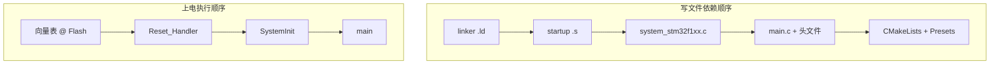

# f103-manual-reg 从零手写构建指南

整理自 embed-dev-lab 开发过程中的问答，说明如何从**空目录**按依赖顺序手写 [`f103-manual-reg`](../../projects/f103-manual-reg/) 所需的链接脚本、启动汇编、时钟与应用代码，并对照 CMSIS 官方模板。

## 与相邻文档的分工

| 文档 | 职责 |
|------|------|
| **本文** | 写什么文件、按什么顺序写、对照 CMSIS 哪些路径 |
| [f103-module-build-flow.md](f103-module-build-flow.md) | 文件写好后，CMake/Ninja 如何编译链接、map 精读 |
| [stm32-bare-metal-bootstrap.md](stm32-bare-metal-bootstrap.md) | `Reset_Handler`、`SystemInit` 运行时行为（Q5/Q11/Q12） |
| [cmsis-overview.md](cmsis-overview.md) | CMSIS 分层与「手写兼容、不链接官方包」判定 |
| [f103-manual-reg 模块说明](../projects/f103-manual-reg.md) | 硬件要点、PC13、烧录排错 |

本工程采用 **CMSIS 规范兼容实现**：保留 `SystemInit`、向量表命名与 Reset 流程，但 **不** `#include` 官方 Device 头、**不** 链接 HAL。详见 [CMSIS 标准与手写裸机边界](cmsis-overview.md) §4。

---

## 1. 两条线总览

从零构建需同时理解 **写文件的依赖顺序** 与 **上电后的执行顺序**——二者不同。



| 线 | 顺序 | 说明 |
|----|------|------|
| **固件语义（写）** | 链接脚本 → startup → system → main | startup 依赖 ld 中的 `_estack`、`_sdata` 等符号 |
| **构建集成** | CMake/Presets → 根 `add_subdirectory` → `build.sh` | 详见 [f103-module-build-flow.md](f103-module-build-flow.md) |
| **运行时（跑）** | 向量表 → `Reset_Handler` → `SystemInit` → `main` | `SystemInit` 由 startup 调用，**不在** `main.c` 里调 |

编译链接语义：各 `.c`/`.s` **分别编译**为 `.obj`，再由链接脚本 **一次拼成** `.elf`；不是汇编 `#include` C。工具链使用 `-nostartfiles` + `--specs=nosys.specs`，不用 gcc 自带 `crt0`，复位入口完全由你的 startup 提供（见 [`toolchain-arm-none-eabi.cmake`](../../cmake/toolchain-arm-none-eabi.cmake)）。

---

## 2. 阶段 0：环境与对照资料

```bash
./scripts/bootstrap.sh          # arm-none-eabi-gcc、probe-rs 等
./scripts/fetch-cmsis.sh        # CMSIS-Core + Device F1 submodule（对照用）
# 可选：
./scripts/fetch-stm32f103-docs.sh   # RM0008 topic MD
```

| 用途 | 命令 / 路径 |
|------|-------------|
| 一键环境 | [`scripts/bootstrap.sh`](../../scripts/bootstrap.sh) |
| CMSIS submodule | [`scripts/fetch-cmsis.sh`](../../scripts/fetch-cmsis.sh) → [`vendor-pack/cmsis-core/`](../../vendor-pack/cmsis-core/) + [`vendor-pack/cmsis-device-f1/`](../../vendor-pack/cmsis-device-f1/) |
| ST 官方摘录 | [`doc/reference/stm32f103/`](../../doc/reference/stm32f103/) |

---

## 3. CMSIS 对照表（只读参照，不链接）

ST Device Family Pack 惯例提供 **三件套**：启动汇编、系统初始化 C、链接脚本。本仓库手写版本与官方模板一一对照。

### 3.1 Device 层（主要参照）

| 用途 | CMSIS 官方路径（submodule） | 本仓库手写对应 |
|------|----------------------------|----------------|
| GCC 启动 | [`vendor-pack/cmsis-device-f1/Source/Templates/gcc/startup_stm32f103xb.s`](../../vendor-pack/cmsis-device-f1/Source/Templates/gcc/startup_stm32f103xb.s) | [`projects/f103-manual-reg/startup/startup_stm32f103xb.s`](../../projects/f103-manual-reg/startup/startup_stm32f103xb.s) |
| 系统初始化 | [`vendor-pack/cmsis-device-f1/Source/Templates/system_stm32f1xx.c`](../../vendor-pack/cmsis-device-f1/Source/Templates/system_stm32f1xx.c) | [`projects/f103-manual-reg/src/system_stm32f1xx.c`](../../projects/f103-manual-reg/src/system_stm32f1xx.c) |
| 链接脚本 | [`vendor-pack/cmsis-device-f1/Source/Templates/gcc/linker/STM32F103XB_FLASH.ld`](../../vendor-pack/cmsis-device-f1/Source/Templates/gcc/linker/STM32F103XB_FLASH.ld) | [`projects/f103-manual-reg/linker/STM32F103C8_FLASH.ld`](../../projects/f103-manual-reg/linker/STM32F103C8_FLASH.ld) |
| 寄存器定义（对照） | [`vendor-pack/cmsis-device-f1/Include/stm32f103xb.h`](../../vendor-pack/cmsis-device-f1/Include/stm32f103xb.h) | **不 `#include`**；[`main.c`](../../projects/f103-manual-reg/src/main.c) 手写基址宏 |

CubeF1 全包内等价路径为 `Drivers/CMSIS/Device/ST/STM32F1xx/Source/Templates/...`（见 [`vendor-pack/STM32CubeF1/README.md`](../../vendor-pack/STM32CubeF1/README.md)）。

### 3.2 Core 层（次要参照）

| 用途 | 路径 |
|------|------|
| 前 16 项内核异常向量顺序 | [`vendor-pack/cmsis-core/Include/core_cm3.h`](../../vendor-pack/cmsis-core/Include/core_cm3.h) |
| NVIC / 向量表概念 | [中断向量表与 NVIC](interrupt-vector-table-and-nvic.md) |

本 demo **仅实现 16 项内核异常**，不含完整外设 IRQ 向量（官方 startup 更长）。

### 3.3 链接脚本：C8 须裁剪 Flash 容量

ST CMSIS 模板 **没有** F103x8（64 KB）专用 linker；社区惯例是以 **F103xB** 模板为底，将 `LENGTH` 改为 **64K**。官方 xB 模板默认 **128K Flash**（见 [`STM32F103XB_FLASH.ld`](../../vendor-pack/cmsis-device-f1/Source/Templates/gcc/linker/STM32F103XB_FLASH.ld) L44），C8T6 须改为 64K，否则链接器会按错误容量排布。

本仓库 [`STM32F103C8_FLASH.ld`](../../projects/f103-manual-reg/linker/STM32F103C8_FLASH.ld) 即此裁剪；内存布局权威核对见 [memory-map-medium-density.md](../reference/stm32f103/md/topics/memory-map-medium-density.md) 与 [STM32F103 内存映射与启动流程](stm32f103-memory-boot-map.md)。

### 3.4 应用层第三参照

| 来源 | 用途 |
|------|------|
| [ST F1 软件仓库归纳 §5](stm32-cmsis-component-repos.md#5-与-embed-dev-lab-的三层参照) | Core / Device / HAL 三层对照总表 |
| 厂商例程 `vendor-pack/.../核心板测试程序(PC13闪烁)/` | PC13 闪烁逻辑、Backup 域顺序 |
| [RCC：HSE → PLL → 72 MHz](../reference/stm32f103/md/topics/rcc-clock-hse-pll.md) | 写 `system_stm32f1xx.c` |
| [Backup 域与 PC13](../reference/stm32f103/md/topics/backup-domain-pc13.md) | PWR+DBP 再配 GPIOC |

---

## 4. 阶段 1–7：文件编写顺序

目标目录结构（与 [模块说明](../projects/f103-manual-reg.md) 一致）：

```text
projects/f103-manual-reg/
├── linker/
├── startup/
└── src/
```

### 阶段 1：目录骨架

创建 `linker/`、`startup/`、`src/` 三个子目录。

### 阶段 2：链接脚本（最先写）

**文件**：[`projects/f103-manual-reg/linker/STM32F103C8_FLASH.ld`](../../projects/f103-manual-reg/linker/STM32F103C8_FLASH.ld)

**为什么先写**：定义 `_estack`、`_sidata`/`_sdata`/`_edata`/`_sbss`/`_ebss`、`ENTRY(Reset_Handler)`，以及 `.isr_vector` 固定在 Flash 物理起始；startup 的 `Reset_Handler` 依赖这些符号。

**要点**：

| 项 | C8T6 值 |
|----|---------|
| Flash `ORIGIN` | `0x08000000`，`LENGTH = 64K` |
| RAM `ORIGIN` | `0x20000000`，`LENGTH = 20K` |
| 栈顶 `_estack` | `0x20005000`（RAM 上界）；满递减栈，**push 时 SP 减小**；详见 [memory-boot-map §6.1](stm32f103-memory-boot-map.md#61-主栈满递减与-_estack) |
| 向量表段 | `KEEP(*(.isr_vector))` 置于 Flash 最前 |

#### 2.1 GNU ld 脚本结构（ENTRY / MEMORY / SECTIONS）

链接脚本使用 **GNU ld** 语法（不是 C）。常见顶层命令自上而下为：

| 命令 | 作用 |
|------|------|
| `ENTRY(...)` | 程序入口符号；本仓库为 `Reset_Handler` |
| `MEMORY { ... }` | 定义物理存储区域：基址、容量、访问属性（`rx` / `rwx`） |
| `SECTIONS { ... }` | 将各 `.o` 的**输入段**合并为**输出段**，并映射到 `MEMORY` 区域 |

**`MEMORY` 与 `SECTIONS` 的分工**：`MEMORY` 回答「有哪些内存、门牌号在哪、多大」；`SECTIONS` 回答「程序各段怎么排、放进哪块内存」。没有 `SECTIONS`，链接器不知道 `.text`、`.data`、`.bss` 该进 Flash 还是 RAM，也无法生成 `_sdata`、`_edata` 等 startup 依赖的符号。

本仓库 [`SECTIONS`](../../projects/f103-manual-reg/linker/STM32F103C8_FLASH.ld) 块中，每个 `.段名 : { ... } > 区域` 的含义：

1. **输出段名**（如 `.text`、`.data`）—— 最终 ELF 里的段
2. **花括号内** —— 从哪些输入段收集内容，例如 `*(.text)` 表示所有 `.o` 里的 `.text`
3. **`> FLASH` / `> RAM`** —— 该段的 **VMA**（运行时地址）
4. **`AT > FLASH`**（仅 `.data`）—— 该段的 **LMA**（烧录镜像在 Flash 中的存放地址）

| 输出段 | VMA | LMA | 说明 |
|--------|-----|-----|------|
| `.isr_vector` | Flash | Flash | 向量表必须在 Flash 物理起始 |
| `.text` | Flash | Flash | 代码与只读常量（XIP） |
| `.data` | RAM | Flash | 已初始化全局变量；`_sidata = LOADADDR(.data)` 供 startup 拷贝 |
| `.bss` | RAM | — | 未初始化全局变量；startup 清零，不占 Flash 镜像 |

链接命令行上 `.obj` 的先后顺序**不决定** Flash 里段布局 —— 向量表仍在最前，因为 `SECTIONS` 先把 `KEEP(*(.isr_vector))` 收进独立输出段。详见 [f103-module-build-flow.md §3.2](f103-module-build-flow.md#32-目标文件链接顺序)。

**VMA / LMA 详解**（逐段对照本仓库 `.ld` 与 startup）：见 **[linker-vma-lma.md](linker-vma-lma.md)**。

#### 2.2 `ALIGN` 与 `KEEP`（`.isr_vector` 段常用）

| 写法 | 含义 |
|------|------|
| `.` | **位置计数器**（location counter）：当前输出段内下一个字节的链接地址 |
| `. = ALIGN(4)` | 将 `.` **向上**取整到 4 字节边界；不足处填 0。Cortex-M 向量表每项 4 字节，须字对齐 |
| `*(.isr_vector)` | 从**所有**目标文件收集名为 `.isr_vector` 的输入段（本仓库来自 startup 的 `g_pfnVectors`） |
| `KEEP(...)` | 强制保留括号内段，**即使**启用 `--gc-sections` / `-ffunction-sections` 也不丢弃 |

向量表不在普通函数调用链上，链接器可能误判为「未引用」而优化掉；`KEEP` 保证其进入最终 ELF。`.isr_vector` 段排在 `.text` 之前且 `> FLASH`，故向量表固定在 `0x08000000`。详见 [中断向量表与 NVIC](interrupt-vector-table-and-nvic.md#链接脚本中的-isr_vector)。

**参照**：CMSIS [`STM32F103XB_FLASH.ld`](../../vendor-pack/cmsis-device-f1/Source/Templates/gcc/linker/STM32F103XB_FLASH.ld)，改 Flash 为 64K；链接脚本与 startup 的「契约」关系见 [f103-module-build-flow.md §4.1](f103-module-build-flow.md#41-链接脚本与-startup-协作)。

### 阶段 3：启动汇编

**文件**：[`projects/f103-manual-reg/startup/startup_stm32f103xb.s`](../../projects/f103-manual-reg/startup/startup_stm32f103xb.s)

**内容**：

1. `.section .isr_vector` → `g_pfnVectors`（栈顶 + Reset + 15 个内核异常）
2. `Reset_Handler`：设 MSP → 拷贝 `.data` → 清零 `.bss` → `bl SystemInit` → `bl main`
3. `.weak` + `Default_Handler` 兜底未实现中断

**参照**：CMSIS 同名 [`startup_stm32f103xb.s`](../../vendor-pack/cmsis-device-f1/Source/Templates/gcc/startup_stm32f103xb.s)；本仓库精简了外设 IRQ 向量。运行时细节见 [stm32-bare-metal-bootstrap.md](stm32-bare-metal-bootstrap.md) Q5/Q11。

### 阶段 4：时钟初始化

**文件**：

- [`projects/f103-manual-reg/src/system_stm32f1xx.h`](../../projects/f103-manual-reg/src/system_stm32f1xx.h) — 声明 `void SystemInit(void);`
- [`projects/f103-manual-reg/src/system_stm32f1xx.c`](../../projects/f103-manual-reg/src/system_stm32f1xx.c) — HSE 8 MHz × PLL9 → 72 MHz；HSE 超时保持 HSI

**为什么先于 main**：startup 在 `main` 前 `bl SystemInit`。

**手册**：[Datasheet 与 Reference Manual 怎么读？](datasheet-vs-reference-manual.md) — 改本文件以 **RM0008 §6 RCC** 为主；HSE 轮询与超时见 [RCC topic](../reference/stm32f103/md/topics/rcc-clock-hse-pll.md) 与 bootstrap Q9。

### 阶段 5：应用代码

**文件**：

- [`projects/f103-manual-reg/src/gpioc_bitband.h`](../../projects/f103-manual-reg/src/gpioc_bitband.h) — `PCout(n)` 位带宏（可选，本工程使用）
- [`projects/f103-manual-reg/src/main.c`](../../projects/f103-manual-reg/src/main.c) — PWR+DBP → GPIOC 时钟 → PC13 推挽 → 闪烁循环

**关键约束**：PC13 属于 Backup 域，必须先 `RCC_APB1ENR.PWREN` + `PWR_CR.DBP`，再写 `GPIOC_CRH`；否则 LED 不亮。详见 [Backup 域与 PC13](../reference/stm32f103/md/topics/backup-domain-pc13.md) 与 [MMIO 基础](stm32f103-mmio-basics.md)。

`gpioc_bitband.h` **不**列入 CMake `SOURCES`，由 `#include` 引入。

### 阶段 6：CMake 构建

**文件**：

- [`projects/f103-manual-reg/CMakePresets.json`](../../projects/f103-manual-reg/CMakePresets.json) — Ninja、`binaryDir=build`、指向 [`cmake/toolchain-arm-none-eabi.cmake`](../../cmake/toolchain-arm-none-eabi.cmake)
- [`projects/f103-manual-reg/CMakeLists.txt`](../../projects/f103-manual-reg/CMakeLists.txt) — `project(... C ASM)`、`embed_mcu_add_executable(...)`

源文件列表示例（`SOURCES` 顺序不影响能否启动，详见 [f103-module-build-flow.md §3.2](f103-module-build-flow.md#32-目标文件链接顺序)）：

```cmake
set(F103_SOURCES
    src/main.c
    src/system_stm32f1xx.c
    startup/startup_stm32f103xb.s
)

embed_mcu_add_executable(f103-manual-reg
    SOURCES ${F103_SOURCES}
    INCLUDE_DIRS ${CMAKE_CURRENT_SOURCE_DIR}/src
    LINKER_SCRIPT ${CMAKE_CURRENT_SOURCE_DIR}/linker/STM32F103C8_FLASH.ld
    MCU_FLAGS "-mcpu=cortex-m3 -mthumb"
)
```

公共构建逻辑在 [`cmake/mcu-config.cmake`](../../cmake/mcu-config.cmake) 的 `embed_mcu_add_executable`。

### 阶段 7：仓库集成与验证

1. 根 [`CMakeLists.txt`](../../CMakeLists.txt) 增加 `add_subdirectory(projects/f103-manual-reg)`（若在 embed-dev-lab 内）
2. 可选：[`doc/projects/f103-manual-reg.md`](../projects/f103-manual-reg.md) 写模块说明
3. 验证：

```bash
./scripts/build.sh f103-manual-reg build
./scripts/build.sh f103-manual-reg flash    # 须先 build；chip: STM32F103C8Tx
```

产物：[`projects/f103-manual-reg/build/f103-manual-reg.elf`](../../projects/f103-manual-reg/build/f103-manual-reg.elf)。`flash` **不会**自动编译。

---

## 5. 与标准 CMSIS 路径对比

| 路径 | 典型组合 | 本仓库 |
|------|----------|--------|
| **手写兼容（本 demo）** | 自写 startup/system + 寄存器 `main` | [`f103-manual-reg`](../../projects/f103-manual-reg/) |
| **官方 CMSIS + HAL** | `#include stm32f103xb.h` + HAL `MX_*_Init` | CubeIDE 风格对照 [`f103-cmsis-hal`](../../projects/f103-cmsis-hal/README.md) |
| **CubeMX 生成** | 引用 CMSIS 模板 + `SystemClock_Config()`（HAL_RCC_*） | 未采用；Cube 引用而非从零生成 startup |

两种裸机路径均符合 Cortex-M3 架构；本仓库取轻量化路径，便于对照手册学 MMIO。判定标准见 [cmsis-overview.md §4](cmsis-overview.md#42-本仓库实例对照)。

---

## 6. 最小验收清单

| 检查项 | 期望 |
|--------|------|
| Flash 布局 | `.isr_vector` @ `0x08000000`；链接脚本 Flash 64K / RAM 20K |
| 复位流程 | 向量表第二项指向 `Reset_Handler`；`ENTRY(Reset_Handler)` |
| 时钟 | HSE 超时不死锁；无晶振板保持 HSI 8 MHz |
| PC13 | PWR+DBP 在配 GPIOC **之前** |
| 工具链 | `-nostartfiles`、`--specs=nosys.specs`（[`toolchain-arm-none-eabi.cmake`](../../cmake/toolchain-arm-none-eabi.cmake)） |
| 烧录 | `probe-rs download --chip STM32F103C8Tx --binary-format elf` |
| map 核对 | 先 `build`，查看 [`f103-manual-reg.map`](../../projects/f103-manual-reg/build/f103-manual-reg.map) — 见 [链接器 Map 文件](linker-map-file.md) |

排错速查：[f103-manual-reg 模块说明 §排错](../projects/f103-manual-reg.md#排错速查) · [PROJECT_MEMORY.md](../../PROJECT_MEMORY.md)「问题 ↔ 解法」。

---

## 延伸阅读

- [f103-module-build-flow.md](f103-module-build-flow.md) — CMake 编译链接、startup 与链接脚本协作、map 精读
- [STM32F103 内存映射与启动流程](stm32f103-memory-boot-map.md) — BOOT 重映射、Flash 物理地址 vs 复位别名
- [STM32 裸机启动与时钟](stm32-bare-metal-bootstrap.md) — SystemInit 来源、RCC 写法、ARM 汇编与 x86 对比
- [CMSIS 标准与手写裸机边界](cmsis-overview.md) — 分层、CubeMX、兼容判定
- [ST F1 软件仓库归纳](stm32-cmsis-component-repos.md) — cmsis-core / cmsis-device-f1 / CubeF1
- [f103-manual-reg 模块说明](../projects/f103-manual-reg.md) — 硬件、烧录、调试
- [脚本参考](../scripts-reference.md) — `build.sh` 全 action
