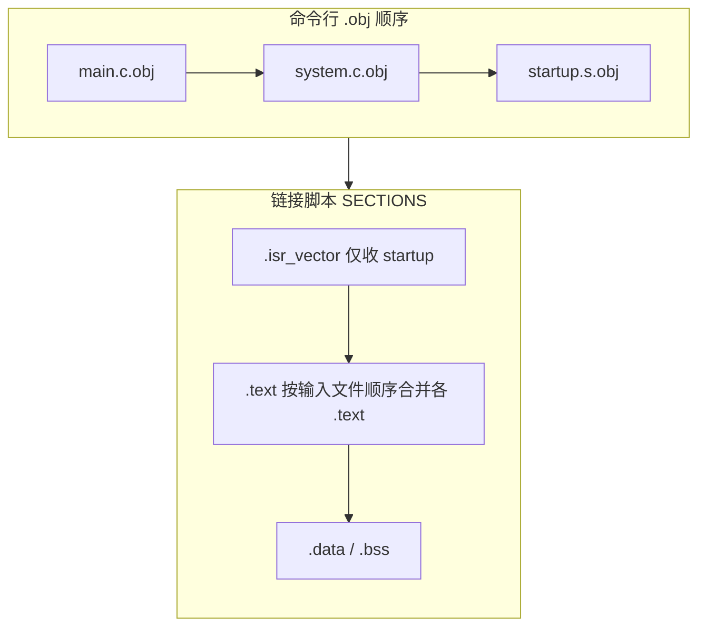
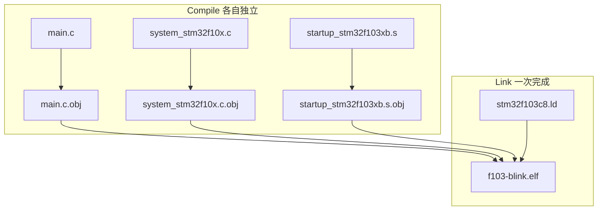

# f103-blink 模块编译流程

整理自 embed-dev-lab 开发过程中的问答，说明 `startup/` 汇编与 `src/` C 文件如何通过 CMake 与链接脚本合并为单一固件。运行时启动语义见 [STM32 裸机启动与时钟](stm32-bare-metal-bootstrap.md) Q5/Q11/Q12。

## 1. 端到端流程总览

日常构建入口：

```bash
./scripts/build.sh f103-blink          # configure + build（默认 all）
./scripts/build.sh f103-blink build      # 仅编译
```


| 阶段 | 位置 | 行为 |
|------|------|------|
| configure | [`scripts/build.sh`](../../scripts/build.sh) → `do_configure` | 在 `modules/f103-blink/` 执行 `cmake --preset debug`，生成 `build/` |
| toolchain | [`cmake/toolchain-arm-none-eabi.cmake`](../../cmake/toolchain-arm-none-eabi.cmake) | 交叉编译：`CMAKE_SYSTEM_NAME Generic`，`arm-none-eabi-gcc` 兼作 C/ASM 编译器 |
| build | `cmake --build --preset debug` | Ninja 编译各源文件为 `.o`，再链接为 `f103-blink.elf` |
| POST_BUILD | [`cmake/mcu-config.cmake`](../../cmake/mcu-config.cmake) | `arm-none-eabi-objcopy -O ihex` 生成 `f103-blink.hex` |

**裸机链接关键**：工具链设 `--specs=nosys.specs -nostartfiles`，**不使用** gcc 自带的 `crt0` 启动文件；复位入口与 C 运行时初始化由模块内 [`startup_stm32f103xb.s`](../../modules/f103-blink/startup/startup_stm32f103xb.s) 提供。

产物目录：`modules/f103-blink/build/`

| 文件 | 说明 |
|------|------|
| `f103-blink.elf` | 链接输出；probe-rs / IDE F5 烧录 |
| `f103-blink.hex` | POST_BUILD 自动生成；OpenOCD 烧录 |
| `f103-blink.map` | 链接 map；概念说明见 [链接器 Map 文件](linker-map-file.md)，本模块实例见 [§3.2 map 精读](#f103-blinkmap-精读链接顺序实证) |
| `compile_commands.json` | clangd 索引；`build.sh` 同步至仓库根 |

---

## 2. CMake 入口与 Presets

### 2.1 仓库根 vs 模块目录

| 入口 | 用途 |
|------|------|
| [`CMakeLists.txt`](../../CMakeLists.txt)（仓库根） | `add_subdirectory(modules/f103-blink)`，聚合子模块 |
| [`modules/f103-blink/CMakePresets.json`](../../modules/f103-blink/CMakePresets.json) | **日常构建**走此 Preset，不依赖根目录 configure |

[`CMakePresets.json`](../../modules/f103-blink/CMakePresets.json) 要点：

- **generator**：Ninja
- **binaryDir**：`${sourceDir}/build`
- **CMAKE_TOOLCHAIN_FILE**：`../../cmake/toolchain-arm-none-eabi.cmake`
- **CMAKE_EXPORT_COMPILE_COMMANDS**：`ON`（供 clangd）

### 2.2 [`modules/f103-blink/CMakeLists.txt`](../../modules/f103-blink/CMakeLists.txt) 逐段解析

```cmake
# 单独打开本模块目录时，自行声明 project
if(CMAKE_SOURCE_DIR STREQUAL CMAKE_CURRENT_SOURCE_DIR)
    cmake_minimum_required(VERSION 3.20)
    project(f103-blink C ASM)
endif()
```

| 行/块 | 含义 |
|-------|------|
| L8–11 | 以模块为工程根打开时声明 `project`；**`ASM` 语言**使 CMake 识别 `.s` 并用汇编器编译 |
| L13 | `include(../../cmake/mcu-config.cmake)` — 引入公共函数 `embed_mcu_add_executable` |
| L15–19 | `F103_SOURCES` — **C 与汇编列在同一列表**，无特殊「合并」语法 |
| L22–27 | 调用 `embed_mcu_add_executable`，传入源文件、头文件目录、链接脚本、MCU 标志 |

完整源文件列表：

```cmake
set(F103_SOURCES
    src/main.c                  # 应用入口与 GPIO 闪烁
    src/system_stm32f10x.c      # SystemInit / 72 MHz 时钟
    startup/startup_stm32f103xb.s # 向量表、.data/.bss、跳转 main
)

embed_mcu_add_executable(f103-blink
    SOURCES ${F103_SOURCES}
    INCLUDE_DIRS ${CMAKE_CURRENT_SOURCE_DIR}/src
    LINKER_SCRIPT ${CMAKE_CURRENT_SOURCE_DIR}/linker/stm32f103c8.ld
    MCU_FLAGS "-mcpu=cortex-m3 -mthumb"
)
```

`gpio_like51.h` 为头文件，由 `#include` 引入，**不**列入 `SOURCES`。

---

## 3. `embed_mcu_add_executable` 做了什么

定义于 [`cmake/mcu-config.cmake`](../../cmake/mcu-config.cmake)，各 `modules/<name>/` 共用。

### 3.1 编译与链接两阶段

```cmake
add_executable(${target_name}.elf ${MCU_SOURCES})
target_link_options(${target_name}.elf PRIVATE
    ${MCU_FLAGS_LIST}
    -T ${MCU_LINKER_SCRIPT}
    -Wl,-Map=${target_name}.map
    -Wl,--gc-sections
)
```

| 阶段 | 工具 | 输入 | 输出 |
|------|------|------|------|
| **编译** | `arm-none-eabi-gcc -c`（C）/ 汇编器（`.s`） | 每个 `.c` / `.s` | 独立目标文件（如 `main.c.obj`） |
| **链接** | `arm-none-eabi-gcc`（链接器前端 `ld`） | 全部 `.o` + 链接脚本 | 单一 `${target_name}.elf` |

Ninja 规则示例（`build/` 内；Windows 下扩展名为 `.obj`，Linux 下多为 `.o`）：

```text
CMakeFiles/f103-blink.elf.dir/src/main.c.obj
CMakeFiles/f103-blink.elf.dir/src/system_stm32f10x.c.obj
CMakeFiles/f103-blink.elf.dir/startup/startup_stm32f103xb.s.obj
  → 链接 → f103-blink.elf
```

### 3.2 目标文件链接顺序

需区分两个概念：**链接命令行上 `.obj` 的先后顺序**，与 **Flash/RAM 中最终段布局** —— 后者不由前者单独决定。

#### 命令行顺序：来自 `F103_SOURCES` 列表

CMake `add_executable(f103-blink.elf ${MCU_SOURCES})` 按 **`SOURCES` 在 `CMakeLists.txt` 中的书写顺序** 生成链接命令。当前顺序为：

```text
main.c.obj → system_stm32f10x.c.obj → startup_stm32f103xb.s.obj
```

可在 `build/build.ninja` 链接规则与 `build/f103-blink.map` 的 `LOAD` 行核对：

```text
build f103-blink.elf: ... main.c.obj system_stm32f10x.c.obj startup_stm32f103xb.s.obj
```

调整 [`CMakeLists.txt`](../../modules/f103-blink/CMakeLists.txt) 中 `F103_SOURCES` 条目顺序，重新 configure 后链接命令行顺序会随之改变。

#### 内存布局顺序：由链接脚本按「段名」决定

[`linker/stm32f103c8.ld`](../../modules/f103-blink/linker/stm32f103c8.ld) 的 `SECTIONS` 规定**输出段**先后，与 `.obj` 在命令行上的先后**无直接对应**：

| 输出段 | 链接脚本规则 | 实际来源 |
|--------|--------------|----------|
| `.isr_vector` @ Flash 起始 | `KEEP(*(.isr_vector))` | 仅 startup 含此段 → **固定 0x08000000** |
| `.text` | `*(.text) *(.text*)` | 各 `.obj` 中带 `.text` 的输入段 |
| `.data` / `.bss` | `*(.data*)` / `*(.bss*)` | 各 C 文件的已初始化/未初始化全局变量 |

因此 **startup 虽在命令行排最后，向量表仍在 Flash 最前** —— 因为链接脚本先把所有 `.isr_vector` 输入段收进独立输出段，再处理 `.text`。向量表与 NVIC 概念见 [中断向量表与 NVIC](interrupt-vector-table-and-nvic.md)。本仓库 `f103-blink.map` 片段：

```text
.isr_vector     0x08000000       0x40
 .isr_vector    0x08000000       0x40  startup_stm32f103xb.s.obj   ← 向量表

.text           0x08000040      0x250
 .text.main     0x080000bc       0x44  main.c.obj
 .text.SystemInit
                0x080001e8       0x58  system_stm32f10x.c.obj
 .text.Reset_Handler
                0x08000240       0x50  startup_stm32f103xb.s.obj   ← 代码段在后
```

同一输出段 `.text` **内部**各函数的前后关系，才与命令行 `.obj` 顺序相关：GNU `ld` 按输入文件顺序依次合并同名输入段，故当前顺序下 `main.c.obj` 的 `.text` 在前、`startup.s.obj` 的 `Reset_Handler` 在后。**这不影响复位与跳转**，因入口由 `ENTRY(Reset_Handler)` 与向量表第二项地址决定，而非 `.text` 段内谁先谁后。

#### 符号解析与顺序无关

`bl SystemInit`、`bl main` 等跨文件调用在链接阶段通过**全局符号表**解析，**不依赖** `.obj` 先后顺序；只要各符号有且仅有一处定义，链接即成功。

#### 链接顺序为何与直觉不同？

常见直觉：**上电先跑 startup，所以 `startup.s.obj` 应该先链接**。这与实际机制不符 —— 混淆了**运行时启动顺序**与**构建时链接命令行顺序**。

| 直觉 | 实际 |
|------|------|
| 上电先跑 startup → 应先链接 | 上电看**向量表**里的函数指针，不看链接命令行谁先谁后 |
| `.s.obj` 应第一个出现在 map 的 `.text` 里 | 向量表已在 Flash 最前（`.isr_vector` 段）；`.text` 内谁先谁后只影响代码在 Flash 中的**排列**，不影响能否启动 |
| 链接顺序 = 执行顺序 | **执行顺序**：复位 → 向量表 → `Reset_Handler` → `SystemInit` → `main` |

当前 `main → system → startup` 仅因 [`CMakeLists.txt`](../../modules/f103-blink/CMakeLists.txt) 里 `F103_SOURCES` **按应用层习惯**（先写 C 业务、后写启动）排列；CMake 不会按「谁上电先跑」自动排序。许多 ST/CMSIS 模板**习惯**把 startup 写在前面，目的是 map 里 `.text` 更易读（`Reset_Handler` 紧挨向量表），**不是为了程序能跑**。

链接器做的是**拼符号地址表**（每个符号最终在 Flash/RAM 的哪），不是排「播放列表」。两件事保证程序正确，均与命令行顺序无关：

1. **段布局** — 链接脚本把 `.isr_vector` 固定在 Flash 起始；
2. **符号解析** — `Reset_Handler`、`SystemInit`、`main` 全部链接完成后统一填地址；向量表第二项指向 `Reset_Handler` 的 Thumb 入口（如 `0x08000241`），与 `Reset_Handler` 在 `.text` 段内靠后并不矛盾。

若希望构建顺序更符合直觉，可将 `startup/...s` 挪到 `F103_SOURCES` **首位**（功能不变，仅 map 可读性变化），见下节实践建议。

#### 实践建议

| 关注点 | 是否需要调整 `F103_SOURCES` 顺序 |
|--------|----------------------------------|
| 向量表在 Flash 起始 | **否** — 靠链接脚本 `.isr_vector` 段 |
| 复位进入 `Reset_Handler` | **否** — 靠 `ENTRY()` + 向量表 |
| `SystemInit` / `main` 能否链上 | **否** — 符号解析与顺序无关 |
| 同一段内函数地址排列 / map 可读性 | 可选 — 仅影响 `.text` 内布局 |

若希望 startup 的 `.text` 紧挨向量表，可将 `startup/...s` 提前到 `F103_SOURCES` 首位，例如：

```cmake
set(F103_SOURCES
    startup/startup_stm32f103xb.s
    src/system_stm32f10x.c
    src/main.c
)
```

重新 configure + build 后，map 中 `.text` 将变为 `Reset_Handler` 在前、`main` 在后；**对本 demo 功能无必要**。



#### `f103-blink.map` 精读（链接顺序实证）

map 文件概念、四大核心内容与通用用途见 **[链接器 Map 文件](linker-map-file.md)**。以下为 f103-blink 实例。

路径：`modules/f103-blink/build/f103-blink.map`（须先 `build` 生成；`build/` 不入 Git）。

**① 命令行 `LOAD` 顺序（L27–29）**

与 `F103_SOURCES` 完全一致：

```text
LOAD .../main.c.obj
LOAD .../system_stm32f10x.c.obj
LOAD .../startup/startup_stm32f103xb.s.obj
```

其后 `START GROUP … libgcc.a libc.a libnosys.a` 为 `--specs=nosys.specs` 引入的运行库，与三个模块 `.obj` 无关。

**② `Discarded input sections`（L2–16）**

因 `-ffunction-sections` 把每个函数拆成独立输入段（如 `.text.main`），各 `.obj` 里**汇总的** `.text` 段为空（size `0x0`），map 开头显示为「丢弃的空段」——属正常现象，不代表代码未链接。

**③ 输出段布局 vs 命令行顺序**

| Flash 地址 | 输出段 / 符号 | 大小 | 来自哪个 `.obj` | 与命令行顺序关系 |
|------------|---------------|------|-----------------|------------------|
| `0x08000000` | `.isr_vector` / `g_pfnVectors` | `0x40` | **startup** | 链接脚本优先收 `.isr_vector`，与 startup 排第三无关 |
| `0x08000040` | `.text.delay` | `0x22` | main | `.text` 内按命令行顺序：main 最先 |
| `0x08000064` | `.text.gpio_configuration` | `0x58` | main | |
| `0x080000bc` | `.text.main` / **`main`** | `0x44` | main | |
| `0x08000100` | `.text.set_sys_clock_to_72mhz` | `0xe8` | system | 第二个 `.obj` |
| `0x080001e8` | `.text.SystemInit` / **`SystemInit`** | `0x58` | system | |
| `0x08000240` | `.text.Reset_Handler` / **`Reset_Handler`** | `0x50` | startup | 第三个 `.obj`，`.text` 段最后 |
| `0x08000274` | `Default_Handler` 等弱符号别名 | — | startup | 与 `Default_Handler` 同址 |

`.text` 输出段总大小 `0x250`（592 字节），起止 `0x08000040`–`0x08000290`。

**④ 向量表如何找到 `Reset_Handler`**

向量表在 `0x08000000`，第二项为复位向量，汇编里写 `.word Reset_Handler`；链接后该字为 **`Reset_Handler` 的 Thumb 入口地址**（`0x08000241`，LSB=1 表示 Thumb）。`Reset_Handler` 函数体在 `.text` 段 `0x08000240` —— 虽在 Flash 布局上位于所有 C 函数**之后**，复位硬件只读向量表中的指针，**不**要求 `Reset_Handler` 紧挨向量表。

```text
0x08000000  g_pfnVectors[0] = _estack = 0x20005000
0x08000004  g_pfnVectors[1] = Reset_Handler+1  →  0x08000241
...
0x08000240  Reset_Handler 函数代码（.text 段靠后）
```

**⑤ RAM 段（L101–119）**

本 demo 无全局变量，`.data` / `.bss` 均为 `0x0`；`_sdata`/`_edata`/`_sbss`/`_ebss` 均等于 `0x20000000`，startup 中拷贝/清零循环仍执行，只是迭代次数为 0。

**⑥ 调试段（L123 起）**

`.debug_info`、`.debug_line` 等同样按 **main → system → startup** 顺序排列，与 `LOAD` 一致；这些段**不烧进 Flash**，仅供 GDB/clangd 使用。

**⑦ 小结对照**

```text
命令行顺序:     main.obj  →  system.obj  →  startup.obj
LOAD 行:          ✓ 同上
.isr_vector:      仅 startup（脚本段名决定，非命令行顺序）
.text 段内:       main 函数 → system 函数 → startup Reset_Handler（跟随命令行）
符号 SystemInit/main:  解析成功，与 .text 内谁先谁后无关
```

查看 map 时优先看 **`Linker script and memory map`** 一节（约 L25 起）；`Discarded input sections` 可忽略。

### 3.3 其他构建选项

| 选项 | 作用 |
|------|------|
| `-ffunction-sections -fdata-sections` | 每个函数/变量独立段 |
| `-Wl,--gc-sections` | 链接时丢弃未被引用的段 |
| Debug：`-O0 -g3` | 调试符号 |
| Release：`-Os` | 体积优化 |
| POST_BUILD `objcopy -O ihex` | 生成 `.hex`（OpenOCD 用） |

---

## 4. startup 与 src 如何「编到一起」

**结论**：不是汇编 `#include` C，也不是 CMake 做特殊合并 —— 是 **分别编译为目标文件 → 链接器按链接脚本布局拼成一个 ELF**。



### 4.1 链接脚本与 startup 协作

[`linker/stm32f103c8.ld`](../../modules/f103-blink/linker/stm32f103c8.ld) 定义 Flash/RAM 布局与段符号；[`startup_stm32f103xb.s`](../../modules/f103-blink/startup/startup_stm32f103xb.s) 在 `Reset_Handler` 中使用这些符号。

| 链接脚本 | startup 使用 |
|----------|--------------|
| `.isr_vector` → Flash 起始 | `g_pfnVectors` 置于 `.section .isr_vector` |
| `_estack = 0x20005000` | `ldr r0, =_estack` 设主栈 |
| `_sidata` / `_sdata` / `_edata` | 将 `.data` 从 Flash（LMA）拷贝到 RAM（VMA） |
| `_sbss` / `_ebss` | 清零 `.bss` |
| `ENTRY(Reset_Handler)` | 芯片复位后从此入口执行 |

向量表固定在 Flash 起始，与 startup 在链接命令行上是否排最后无关 —— 见 [§3.2 目标文件链接顺序](#32-目标文件链接顺序)。

Flash 布局（简化）：

```text
0x08000000  .isr_vector   ← g_pfnVectors（startup）
            .text          ← Reset_Handler、SystemInit、main、delay 等
            .rodata        ← 只读常量
            (.data 的 LMA) ← 初始化数据的 Flash 镜像
0x20000000  .data          ← 已初始化全局变量（RAM）
            .bss           ← 未初始化全局变量（RAM）
0x20005000  _estack        ← 栈顶（向下增长）
```

### 4.2 跨文件符号解析

链接阶段解析 startup 中的 `bl` 目标：

| startup 引用 | 定义位置 |
|--------------|----------|
| `bl SystemInit` | [`src/system_stm32f10x.c`](../../modules/f103-blink/src/system_stm32f10x.c) |
| `bl main` | [`src/main.c`](../../modules/f103-blink/src/main.c) |

C 中的 `delay()`、`gpio_configuration()` 等进入 `.text`，与 `Reset_Handler` 同处 Flash，由链接器统一排布地址；无需 startup 显式调用。

---

## 5. 产物与烧录

| 命令 | 使用文件 | 说明 |
|------|----------|------|
| `./scripts/build.sh f103-blink flash` | `.elf` | probe-rs `--binary-format elf` |
| `./scripts/build.sh f103-blink flash-openocd` | `.hex` | 须先 `build` |
| IDE **F103 Probe-rs Debug**（F5） | `.elf` | 见 [ide-debug.md](../ide-debug.md) |

`flash` **不会**自动编译；改源码后须先 `build`。详见 [f103-blink 模块说明](../modules-f103-blink.md) 与 [probe-rs.md](../probe-rs.md)。

---

## 6. 新增模块参考

1. 复制 [`modules/f103-blink/`](../../modules/f103-blink/) 目录结构（`CMakeLists.txt`、`CMakePresets.json`、`startup/`、`linker/`、`src/`）
2. 在 `CMakeLists.txt` 中调整 `F103_SOURCES` 与 `LINKER_SCRIPT`，调用 `embed_mcu_add_executable()`
3. `./scripts/build.sh <新模块名>`

---

## 延伸阅读

- [链接器 Map 文件](linker-map-file.md) — map 是什么、核心内容、六大用途、生成方式
- [STM32 裸机启动与时钟](stm32-bare-metal-bootstrap.md) — Reset_Handler、`SystemInit` 运行时行为（Q5/Q11/Q12）
- [f103-blink 模块说明](../modules-f103-blink.md) — 硬件要点、PC13、构建命令
- [脚本参考](../scripts-reference.md) — `build.sh` action 与自动化链路
- [CMSIS 标准与手写裸机边界](cmsis-overview.md) — startup 规范兼容判定
