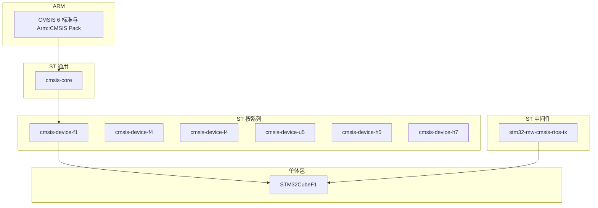

# ST CMSIS 组件仓库归纳

整理 STM32Cube 生态下 **CMSIS 相关 MCU Component** 仓库的职责、层级关系与版本配对规则。与 [CMSIS 标准与手写裸机边界](cmsis-overview.md) 对照阅读。

官方 CMSIS 6 总览：[CMSIS Introduction](https://arm-software.github.io/CMSIS_6/latest/General/index.html)

---

## 1. 两层交付模型

ST 自 2019 年起将原单体 **STM32Cubexx** 固件包拆为独立 Git 仓库（**MCU Component**），同时仍保留完整 **MCU Package**：

| 模型 | 代表 | 内容 |
|------|------|------|
| **MCU Component** | `cmsis-core`、`cmsis-device-f1` 等 | 按功能拆分的可独立获取模块 |
| **MCU Package** | [STM32CubeF1](https://github.com/STMicroelectronics/STM32CubeF1) 等 | Core + Device + HAL/LL + Middleware + 例程的聚合包 |

Component 便于按需取用；Package 便于一键获取与 CubeMX/CubeIDE 工程对齐。



---

## 2. 仓库职责总表

| 仓库 | CMSIS 层级 | 核心职责 | 适用系列 | embed-dev-lab |
|------|------------|----------|----------|---------------|
| [cmsis-core](https://github.com/STMicroelectronics/cmsis-core) | **Core** | ARM CMSIS-Core 的 ST 镜像；`core_cm*.h`、NVIC/SysTick/SCB 访问、编译器适配头；根目录 `Include/` 为 `Core/Include/` 的兼容副本 | 全 STM32；tag 后缀 `_cm0` / `_cm3` / `_cm4` / `_cm7` 等按内核精简 | **git submodule** [`vendor-pack/cmsis-core`](../../vendor-pack/cmsis-core)；说明见 [`cmsis-core.embed-dev-lab.md`](../../vendor-pack/cmsis-core.embed-dev-lab.md) |
| [cmsis-device-f1](https://github.com/STMicroelectronics/cmsis-device-f1) | **Device** | F1 外设寄存器头文件（如 `stm32f103xb.h`）、`IRQn` 枚举、各工具链 `startup_*.s`、`system_stm32f1xx.c` | STM32F1 | **git submodule** [`vendor-pack/cmsis-device-f1`](../../vendor-pack/cmsis-device-f1)；[`cmsis-device-f1.embed-dev-lab.md`](../../vendor-pack/cmsis-device-f1.embed-dev-lab.md) |
| [cmsis-device-f4](https://github.com/STMicroelectronics/cmsis-device-f4) | **Device** | F4 系列设备描述与启动模板 | STM32F4 | 文档归纳；本仓库未集成 |
| [cmsis-device-l4](https://github.com/STMicroelectronics/cmsis-device-l4) | **Device** | L4 低功耗系列设备描述与启动模板 | STM32L4 | 同上 |
| [cmsis-device-u5](https://github.com/STMicroelectronics/cmsis-device-u5) | **Device** | U5 系列（含 TrustZone 等）设备描述与启动模板 | STM32U5 | 同上 |
| [cmsis-device-h5](https://github.com/STMicroelectronics/cmsis-device-h5) | **Device** | H5 系列设备描述与启动模板 | STM32H5 | 同上 |
| [cmsis-device-h7](https://github.com/STMicroelectronics/cmsis-device-h7) | **Device** | H7 高性能/双核系列设备描述与启动模板 | STM32H7 | 同上 |
| [stm32-mw-cmsis-rtos-tx](https://github.com/STMicroelectronics/stm32-mw-cmsis-rtos-tx) | **Middleware** | **CMSIS-RTOS v2** API 对 **Azure RTOS ThreadX** 的封装适配层（**非** FreeRTOS 封装） | 全系列通用中间件组件 | 可选；当前 [`f103-blink`](../../modules/f103-blink/) 未使用 |

### 2.1 cmsis-core 要点

- 自 ARM [CMSIS_5/CMSIS](https://github.com/ARM-software/CMSIS_5) / [CMSIS_6](https://github.com/ARM-software/CMSIS_6) 同步，由 ST 维护发布节奏与 Pack 描述（`STMicroelectronics.CMSIS.pdsc`）。
- **必须选用带版本号的 tag**，勿在工程里跟踪 `master`。
- 每个正式 tag（如 `v5.4.0`）提供按内核精简的变体：`v5.4.0_cm3` 仅含 Cortex-M3 相关头文件，体积远小于全核包。
- 同后缀 tag 归属同一分支（如 `cm3` 分支汇集 `v4.5_cm3`、`v5.4.0_cm3`、`v5.6.0_cm3`）。

### 2.2 cmsis-device-* 要点

- **只做硬件描述**：寄存器基址与位域、`IRQn_Type`、链接脚本/启动文件框架、`SystemInit()` 模板。
- **不提供**外设业务 API（那是 HAL/LL 层）。
- 启动文件按工具链分目录：`gcc` / `iar` / `arm`（Keil MDK），向量表顺序一致，汇编语法不同。

### 2.3 stm32-mw-cmsis-rtos-tx 要点

- 属于 STM32Cube **Middleware** 组件，不是 Core/Device 层。
- 在 ThreadX 之上实现 [CMSIS-RTOS2](https://arm-software.github.io/CMSIS_6/latest/RTOS2/index.html) 标准 API，便于中间件与工具链以统一 RTOS 接口集成。
- 若使用 FreeRTOS，Cube 生态通常走 **CMSIS-RTOS v2 wrapper for FreeRTOS**（不同中间件包），勿与本仓库混淆。

---

## 3. 版本配对规则

**CMSIS-Core 与 CMSIS-Device 版本必须成对使用。** 各 `cmsis-device-*` 仓库 README / Release Notes 提供与 Core tag 的对应表。

### 3.1 F1 示例（本仓库相关）

摘自 [cmsis-device-f1](https://github.com/STMicroelectronics/cmsis-device-f1) 兼容表（节选）：

| CMSIS Device F1 | CMSIS Core（ST tag） | 完整 MCU Package |
|-----------------|----------------------|------------------|
| v4.3.1 – v4.3.3 | v5.4.0_cm3 | STM32CubeF1 v1.8.0 – v1.8.4 |

本仓库 submodule 固定 **cmsis-core `v5.4.0_cm3`** + **cmsis-device-f1 `v4.3.3`**（与 [cmsis-device-f1](https://github.com/STMicroelectronics/cmsis-device-f1) 兼容表一致）。可选再 fetch STM32CubeF1 全包获取 HAL/例程。

### 3.2 其他系列

F4、L4、H5、H7、U5 等 device 仓库 README 均强调：**查阅对应 Release Note 选用匹配的 Core tag**；新版系列可能已对齐 CMSIS 6.x Core 组件。

---

## 4. CMSIS 5 → 6 目录变更

ARM 自 CMSIS 5.0 起将 Core 头文件从根 `Include/` 迁至 `Core/Include/`（[CMSIS 6 迁移说明](https://arm-software.github.io/CMSIS_6/latest/General/index.html#Migration_from_CMSIS_v5)）。

ST `cmsis-core` 在仓库根保留 **`Include/` 副本**，使旧工程与 Cube 目录树仍可通过 `Drivers/CMSIS/Include` 风格包含头文件。

| 路径风格 | 示例 |
|----------|------|
| ST 兼容（根 `Include/`） | `vendor-pack/cmsis-core/Include/core_cm3.h` |
| ARM 标准（`Core/Include/`） | `vendor-pack/cmsis-core/Core/Include/core_cm3.h` |

---

## 5. 与 embed-dev-lab 的三层参照

本仓库 F103 demo 采用「手写 CMSIS **兼容**实现」，不链接官方 CMSIS 源码：

| 层级 | 参照来源 | 用途 |
|------|----------|------|
| **Core** | submodule `vendor-pack/cmsis-core` | 对照 `core_cm3.h`、NVIC 内联函数、编译器头 |
| **Device** | submodule `vendor-pack/cmsis-device-f1` | 对照官方 `startup_stm32f103xb.s`、`system_stm32f1xx.c`、`stm32f103xb.h` |
| **HAL/全包** | `vendor-pack/STM32CubeF1/`（fetch 后，可选） | HAL、Middleware、例程 |
| **应用** | [`modules/f103-blink`](../../modules/f103-blink/) | 手写 `startup` / `system_stm32f10x.c`，遵循 `SystemInit` 与向量表规范，**不参与 CMake 链接官方包** |

详见 [CMSIS 标准与手写裸机边界](cmsis-overview.md) §4。

---

## 6. 获取命令速查

```bash
# CMSIS-Core + CMSIS-Device F1（submodule）
./scripts/fetch-cmsis.sh
./scripts/fetch-cmsis.sh --verify-only

# HAL / 全包（可选）
./scripts/fetch-stm32cubef1.sh
./scripts/fetch-stm32cubef1.sh --verify-only
```

首次 clone 建议：`git clone --recursive <repo-url>`

---

## 延伸阅读

- [CMSIS 标准与手写裸机边界](cmsis-overview.md)
- [中断向量表与 NVIC](interrupt-vector-table-and-nvic.md)
- [vendor-pack/cmsis-core.embed-dev-lab.md](../../vendor-pack/cmsis-core.embed-dev-lab.md)
- [vendor-pack/cmsis-device-f1.embed-dev-lab.md](../../vendor-pack/cmsis-device-f1.embed-dev-lab.md)
- [STM32CubeF1 本地固件包](../../vendor-pack/STM32CubeF1/README.md)
- [ARM CMSIS 6 官方文档](https://arm-software.github.io/CMSIS_6/latest/General/index.html)
