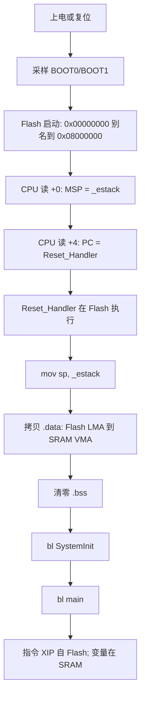

# STM32F103 内存映射与启动流程

整理自 embed-dev-lab 开发过程中的问答，说明 F103C8 上 **Flash / SRAM / 启动重映射** 的硬件基础、地址空间、链接布局与复位加载流程。寄存器地址以 [RM0008](../reference/stm32f103/md/rm0008-index.md) / [DS5319](../reference/stm32f103/md/datasheet-index.md) 为准；与本仓库 [`f103-manual-reg`](../../projects/f103-manual-reg/) 的链接脚本、startup 直接对应。

权威摘录表见 [memory-map-medium-density.md](../reference/stm32f103/md/topics/memory-map-medium-density.md)。

---

## 一句话总结

**Main Flash 存程序与非易失镜像；SRAM 存运行时变量与栈；复位时 CPU 从 `0x00000000` 读向量表（Flash 启动下别名到 `0x08000000`），链接脚本则使用 Flash 物理地址 `0x08000000`。** 重映射是地址转发，不复制数据；代码多数在 Flash 原地执行（XIP），仅 `.data` 段由 startup 拷贝到 SRAM。

---

## 1. 两个地址概念（避免混淆）

| 概念 | 地址 | 含义 |
|------|------|------|
| **逻辑重映射窗口** | `0x0000_0000` 起（Code 区内） | 上电复位时，硬件把该窗口**镜像映射**到某块真实存储的基址；窗口本身**无独立物理芯片** |
| **物理存储门牌号** | Flash `0x0800_0000`、SRAM `0x2000_0000` 等 | 芯片 memory map 中的固定地址；链接脚本、烧录、map 文件使用 |

读 `0x00000000` 时，硬件**自动转发**到当前 BOOT 模式选定的物理基址——**不会复制数据**，各物理存储区互不干扰。

---

## 2. ARM 32 位 4 GB 地址空间

Cortex-M3 可发出 **`0x00000000` – `0xFFFFFFFF`**（2³² 字节）地址。这是 **CPU 寻址范围**，不是「芯片上有 4 GB RAM」。

不同地址区间接不同硬件（memory map）：

```text
0x00000000  ┌─────────────────────────────┐
            │ Code 区（含启动重映射窗口）    │
0x08000000  ├─────────────────────────────┤  ← Main Flash（用户固件）
            │ …                           │
0x1FFFF000  ├─────────────────────────────┤  ← System memory（出厂 ROM）
0x20000000  ├─────────────────────────────┤  ← SRAM
0x40000000  ├─────────────────────────────┤  ← ST 外设（RCC、GPIO…）见 [MMIO 基础](stm32f103-mmio-basics.md)
0xE0000000  ├─────────────────────────────┤  ← PPB 内核私有（NVIC、SysTick、SCB/VTOR）见 [§2.1](#21-soc-分层cpu-内核-vs-st-外设-vs-ppb)
0xFFFFFFFF  └─────────────────────────────┘
```

F103 裸机无 MMU：链接器与调试器中的地址 **即 CPU 实际访问的平坦物理地址**（与 x86 用户态虚拟地址不同，见 [§8](#8-与-x86-虚拟地址对比)）。

### 2.1 SoC 分层：CPU 内核 vs ST 外设 vs PPB

**STM32F103 是一颗 SoC（片上系统）**，不只有「外设」，还包含 ARM 授权的 **CPU 内核**：

```text
┌─────────────────────────────────────────┐
│  STM32F103 芯片                          │
│  ┌───────────────────────────────────┐  │
│  │ Cortex-M3 内核（ARM IP）            │  │
│  │  CPU + NVIC + SysTick + SCB/VTOR   │  │  ← 寄存器在 PPB 0xE000xxxx
│  └───────────────────────────────────┘  │
│  ┌───────────────────────────────────┐  │
│  │ ST 设计的片上外设                   │  │  ← 寄存器在 0x400xxxxx
│  │  RCC、GPIO、USART、TIM、Flash 控制器… │  │
│  └───────────────────────────────────┘  │
│  Main Flash、SRAM、System ROM            │
└─────────────────────────────────────────┘
```

| 类别 | 谁设计 | 地址区（F103） | 例子 | 本仓库 |
|------|--------|----------------|------|--------|
| **PPB 内核私有** | ARM | `0xE0000000` 起 | NVIC、SysTick、SCB/VTOR | 手写未直接访问；见 [中断向量表与 NVIC](interrupt-vector-table-and-nvic.md) |
| **ST 片上外设** | ST | `0x40000000` 起 | RCC @ `0x40021000`、GPIOC @ `0x40011000` | [`main.c`](../../projects/f103-manual-reg/src/main.c) MMIO |

**都在同一块硅片上**，但 ARM 与 ST 在手册里分地址段、分章节。**NVIC 不是 GPIO 那种 ST 外设**；复位后查向量表由内核/NVIC 机制配合 Flash 中的 `g_pfnVectors` 完成。

### Memory map 不是什么

- **不是**把 Flash 或外设「拷贝进 RAM」——只有 `.data` 段初值在启动时 Flash→SRAM 拷贝。
- **不是** Boot 别名窗口的同义词——别名仅指 `0x00000000` 段对 Flash/SRAM/System ROM 的转发（见 [§1](#1-两个地址概念避免混淆)）。
- **是** **地址解码**：CPU 发出某地址 → 总线/解码器选中 Flash、SRAM、ST 外设或 PPB 之一；外设寄存器读写称 **memory-mapped I/O**，详见 [stm32f103-mmio-basics.md](stm32f103-mmio-basics.md)。

---

## 3. Flash、SRAM、System memory 是什么？

| 硬件 | 类型 | F103C8 容量 | 物理基址 | 掉电 | 典型用途 |
|------|------|-------------|----------|------|----------|
| **Main Flash** | 非易失 NOR Flash | 64 KB | `0x0800_0000` | 保留 | 程序、常量、`.data` 初始镜像 |
| **SRAM** | 易失静态 RAM | 20 KB | `0x2000_0000` | 丢失 | `.data`/`.bss`、栈、局部变量 |
| **System memory** | 出厂 Mask ROM | 12 KB（medium-density） | `0x1FFFF000` | 保留 | ST 内置 ISP Bootloader |
| **Option bytes** | 配置 Flash | 16 B | `0x1FFFF800` | 保留 | RDP、写保护、USER 配置 |
| **UID** | OTP 只读 | 96 bit | `0x1FFFF7E8` | 固定 | 芯片唯一序列号 |

**Flash ≠ RAM**：工艺、读写方式、用途均不同。程序**不是**「整片 Flash 映射成 RAM」；仅 **`.data` 段的初值**在启动时从 Flash **拷贝**到 SRAM，代码仍在 Flash 执行。

---

## 4. BOOT 引脚与三种启动模式

`0x00000000` 是**地址重映射窗口**基址；上电采样 **BOOT0 / BOOT1** 后，硬件决定该窗口镜像到哪块物理存储：

| 启动模式 | BOOT0 | BOOT1 | 逻辑 `0x00000000` 映射到物理基址 | 物理硬件 | 典型场景 |
|----------|-------|-------|----------------------------------|----------|----------|
| **Main Flash** | 0 | X | `0x0800_0000` | 用户 Main Flash | 量产正常运行（默认） |
| **System memory（ISP）** | 1 | 0 | `0x1FFFF000` | 出厂 ROM Bootloader | 串口/CAN 烧录空白芯片 |
| **SRAM** | 1 | 1 | `0x2000_0000` | 片内 SRAM | 调试器加载 RAM 代码，断电丢失 |

### 三种模式下读 `0x00000000` 得到什么

**模式 1 — Flash 启动（本仓库默认）**

- `0x00000000`（逻辑）= `0x08000000`（物理）：向量表第 0 项 **初始 MSP**（`_estack`）
- `0x00000004`（逻辑）= `0x08000004`（物理）：向量表第 1 项 **`Reset_Handler` 入口**
- 往后：NMI/HardFault…、用户代码、只读常量

**模式 2 — ISP 启动**

- 逻辑 `0x00000000` → 物理 `0x1FFFF000`：ST 内置 Bootloader 的向量表与下载协议代码

**模式 3 — SRAM 启动**

- 逻辑 `0x00000000` → 物理 `0x20000000`：须事先由调试器写入 SRAM 的向量表与代码；单独上电无法自启动

### 补充区分

| 维度 | Flash / ISP | SRAM 启动 |
|------|-------------|-----------|
| 掉电 | 非易失，数据保留 | 全部丢失 |
| 自启动 | 可独立上电运行 | 须调试器预加载 |
| Flash 擦写寿命 | 有次数限制 | 无（不写 Flash） |

---

## 5. `0x08000000` 之前有什么？

### 5.1 `0x00000000` – `0x07FFFFFF`：启动重映射窗口

属于 ARM **Code 区**内的逻辑窗口，**无实体存储芯片**；访问时由硬件转发到 Flash / System memory / SRAM 之一（见 §4）。

### 5.2 `0x08000000` 之前、System 区附近的真实 Flash/OTP 硬件

Main Flash 物理上从 **`0x08000000`** 开始；**不是**「在 `0x0000` 段还有隐藏 Flash」。`0x08000000` 之前另一处有实体存储的是 **`0x1FFFFxxx` 系统区**（与 Main Flash 不连续）：

| 区域 | 地址（medium-density） | 内容 |
|------|------------------------|------|
| System memory | `0x1FFFF000` – `0x1FFFF2FF`（12 KB） | ST 出厂 ISP Bootloader，用户不可擦写 |
| Flash 容量寄存器 | `0x1FFFF7E0` | 只读容量信息 |
| 唯一 ID（UID） | `0x1FFFF7E8` – `0x1FFFF7F7` | 96 bit 芯片序列号，只读 |
| Option bytes | `0x1FFFF800` – `0x1FFFF80F` | RDP、写保护、USER 等，可经 FPEC 配置 |

`0x08010000`（C8 Flash 末尾之后）至 `0x1FFEFFFF` 等区域在 C8 上**无用户 Flash**，访问可能 fault 或无效（以 RM0008 为准）。

---

## 6. F103C8 Main Flash 链接布局（f103-manual-reg）

[`STM32F103C8_FLASH.ld`](../../projects/f103-manual-reg/linker/STM32F103C8_FLASH.ld) 将 **64 KB Flash** 与 **20 KB SRAM** 排布如下：

```text
Flash 物理 0x08000000          SRAM 物理 0x20000000
─────────────────────          ─────────────────────
.isr_vector                    .data（VMA，运行时）
  [+0] _estack                   ← startup 从 Flash LMA 拷贝
  [+1] Reset_Handler 指针
.text（代码 + .rodata）          .bss（startup 清零）
.data 的 LMA（初值镜像）          栈 MSP 向下增长
                                 _estack = 0x20005000
0x0800FFFF（64 KB 末）
```

| 段 | VMA（运行地址） | LMA（加载/存储地址） | 说明 |
|----|-----------------|----------------------|------|
| `.isr_vector` | Flash | Flash | 向量表必须在 Flash 最前 |
| `.text` / `.rodata` | Flash | Flash | 指令与常量，XIP 执行 |
| `.data` | **SRAM** | **Flash** | 已初始化全局变量 |
| `.bss` | SRAM | — | 未初始化全局变量 |

构建后可用 [`f103-manual-reg.map`](../../projects/f103-manual-reg/build/f103-manual-reg.map) 核对（须先 `./scripts/build.sh f103-manual-reg build`），见 [linker-map-file.md](linker-map-file.md)。

---

## 7. 完整启动加载流程（Flash 启动）



与 x86 对比：无 BIOS/OS loader；无整盘 ELF 载入 RAM；**仅 `.data` 拷贝 + 代码 Flash 原地跑**。`Reset_Handler` 细节见 [interrupt-vector-table-and-nvic.md](interrupt-vector-table-and-nvic.md)、[stm32-bare-metal-bootstrap.md Q11](stm32-bare-metal-bootstrap.md#q11systeminit-是怎么调用的)。

本仓库烧录：`probe-rs` 将 ELF 写入 **Main Flash 物理区** `0x08000000` 起；复位后别名窗口使 CPU 仍从逻辑 `0x00000000` 读到同一向量表。

---

## 8. 与 x86 虚拟地址对比

| | F103 裸机（Cortex-M3） | x86 用户态程序 |
|---|------------------------|----------------|
| MMU | 无 | 有 |
| 链接/调试地址 | 平坦物理地址 | 多为虚拟地址 |
| 程序加载 | 向量表 + startup；`.data` 手动拷贝 | OS loader + crt0 |
| 外设 | 固定 `0x400xxxxx`，直接读写 | 内核映射，应用不直接访问 |
| 4 GB 含义 | 统一 memory map，非 4 GB RAM | 每进程独立虚拟空间 |

ARM 汇编与 x86 启动职责对比见 [stm32-bare-metal-bootstrap.md Q12](stm32-bare-metal-bootstrap.md#q12startup_stm32f103xbs-是汇编写的吗和-x86-汇编有什么区别)。

---

## 9. 本仓库关联文件

| 文件 | 作用 |
|------|------|
| [`linker/STM32F103C8_FLASH.ld`](../../projects/f103-manual-reg/linker/STM32F103C8_FLASH.ld) | Flash/RAM 边界、段布局、`_estack` 等符号 |
| [`startup/startup_stm32f103xb.s`](../../projects/f103-manual-reg/startup/startup_stm32f103xb.s) | 向量表、`Reset_Handler`、`.data`/`.bss` 初始化 |
| [`doc/learn/f103-module-build-flow.md`](f103-module-build-flow.md) | CMake 链接、段与 startup 协作 |
| [`doc/learn/interrupt-vector-table-and-nvic.md`](interrupt-vector-table-and-nvic.md) | 向量表、MSP/PC、NVIC |

---

## 延伸阅读

| 主题 | 文档 |
|------|------|
| MMIO、flip-flop、手册地址与 PC13 点灯 | [stm32f103-mmio-basics.md](stm32f103-mmio-basics.md) |
| RM0008 地址摘录（Boot、System memory、UID、OB） | [memory-map-medium-density.md](../reference/stm32f103/md/topics/memory-map-medium-density.md) |
| 为什么链接脚本用 `0x08000000` 而复位提 `0x00000000` | [stm32-bare-metal-bootstrap.md Q13](stm32-bare-metal-bootstrap.md#q13为什么链接脚本用-0x08000000复位却从-0x00000000-读向量表) |
| 链接 map 验证 | [linker-map-file.md](linker-map-file.md) |
| DS5319 / RM0008 分工 | [datasheet-vs-reference-manual.md](datasheet-vs-reference-manual.md) |
