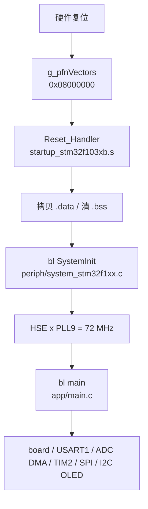

# f103-manual-reg 模块

**STM32F103C8T6** 核心板 demo：**PC13 / PB12 LED** + **PB13 KEY（EXTI）** + **USART1 DMA+空闲中断（printf + 整帧回显）** + **ADC1 PA0 旋钮（DMA 连续）** + **TIM2 PA1 风扇** + **SPI1 BMP280 温度/气压**（LSM6 驱动保留、`main` 不访问）+ **I2C1 SH1106 数字时钟（右下温度，失败画 `0.00C`）**，纯寄存器实现；PC13 行为对齐厂商例程 `vendor-pack/.../核心板测试程序(PC13闪烁)`。

## 模块定位

| 项 | 说明 |
|----|------|
| 目标芯片 | STM32F103C8T6（Cortex-M3，Medium-density F103xB，64 KB Flash / 20 KB RAM） |
| 实现方式 | 全手写 `startup` / `system_stm32f1xx.c` / GPIO·USART·SPI·ADC·I2C 寄存器，**不链接** CMSIS submodule 与 HAL |
| 应用功能 | PC13 / PB12 同步翻转（位带 `PCout` / `PBout`）；PB13 上拉 + EXTI13 双沿；USART1 @ PA9/PA10，1500000 bps，DMA TX/RX + 空闲定界 + `printf` + 整帧回显；ADC1 CH0 @ PA0 连续 + DMA1 CH1，旋钮 raw→TIM2 风扇占空比；SPI1 → BMP280（校准补偿温度/气压，无湿度；失败 OLED `0.00C`）；LSM6DS3 驱动保留、`main` 不访问；I2C1 → SH1106 中央 `HH:MM:SS`、右下温度（写地址 `0x78`） |
| 标准库 | 工具链 **newlib**（`libc.a`）+ 工程内 [`syscalls.c`](../../projects/f103-manual-reg/src/periph/syscalls.c) 重定向 `_write` |
| 对照工程 | [`f103-cmsis-hal`](f103-cmsis-hal.md) — 当前阶段 HAL 工程仍以 LED+USART 为主（本轮未同步 SPI / ADC） |
| 参照关系 | vendor-pack 三层见 [ST F1 软件仓库归纳 §5](../learn/stm32-cmsis-component-repos.md#5-与-embed-dev-lab-的三层参照)；从零手写见 [从零手写构建指南](../learn/f103-manual-build-from-scratch.md) |

## 目录结构

```text
projects/f103-manual-reg/
├── CMakeLists.txt
├── CMakePresets.json
├── src/
│   ├── app/
│   │   └── main.c              # 应用：初始化顺序、旋钮→风扇、OLED 时钟
│   ├── board/
│   │   ├── gpio.c / gpio.h     # PC13 Backup 域、PB12 LED、PB13 上拉
│   │   ├── key.c / key.h       # EXTI13 双沿，IRQn 40
│   │   └── gpioc_bitband.h     # PCout / PBout / PBin
│   ├── periph/
│   │   ├── nvic.c / nvic.h     # NVIC ISER/IP
│   │   ├── dma.c / dma.h       # DMA1 通道启停
│   │   ├── adc.c / adc.h       # ADC1 CH0 连续 + DMA1 CH1
│   │   ├── usart.c / usart.h   # USART1 DMA + IDLE
│   │   ├── spi.c / spi.h       # SPI1 Mode0/3，DMA1 CH2/CH3
│   │   ├── tim2.c / tim2.h     # TIM2_CH2 PA1 PWM
│   │   ├── i2c.c / i2c.h       # I2C1；页 DMA1 CH6
│   │   ├── systick.c / .h      # SysTick 1 ms
│   │   ├── syscalls.c          # printf → USART1
│   │   └── system_stm32f1xx.c / .h
│   └── driver/
│       ├── bmp280.c / .h       # 校准、补偿 T/P（CS=PA3）
│       ├── lsm6ds3.c / .h      # 保留，main 不调用
│       └── sh1106.c / .h + font
├── startup/
│   └── startup_stm32f103xb.s
└── linker/
    └── STM32F103C8_FLASH.ld
```

## 运行时初始化顺序

```text
上电/复位（硬件）
  → 读向量表 g_pfnVectors @ 0x08000000
       [0] _estack → MSP
       [1] Reset_Handler → PC
  → Reset_Handler（startup/startup_stm32f103xb.s）
       设 SP → 拷贝 .data → 清零 .bss
  → bl SystemInit（src/periph/system_stm32f1xx.c）
       HSE 8 MHz × PLL×9 → SYSCLK 72 MHz（失败则 HSI 8 MHz）
  → bl main（src/app/main.c）
       1. GPIOC_Init()    — PWR+DBP、PC13 推挽输出
       2. GPIOB_Init()    — IOPBEN、PB12 推挽、PB13 上拉输入
       3. Key_ExtiInit()  — EXTI13 双沿，IRQn 40
       4. USART1_Init()   — 1500000 8N1，DMAT/DMAR + IDLEIE；USART1_EnableEcho()
       5. ADC1_Init()     — PA0 模拟、校准、CONT + DMA1 CH1
       6. TIM2_PWM_Init() — PA1 PWM，24 kHz
       7. SysTick_Init()  — 1 ms
       8. SPI1_Init()     — PA5/6/7 + PA3/PA8 CS，默认 Mode 3
       9. I2C1_Init()     — PB6/PB7，400 kHz
      10. 延时 ≥20 ms     — 传感器上电
      11. BMP280_Probe / Init（失败则循环画 0.00C）
      12. SH1106_Probe / Init
      13. for(;;) ProcessRx + EXTI 边沿日志 + 旋钮→风扇 + 1 Hz 时钟/温度 + LED/KEY/knob
```



`main` **不会**再调用 `SystemInit`。链接使用 `-nostartfiles`，无工具链 crt0；C 运行时最小初始化全在 `Reset_Handler`。
## 源码地图

| 文件 | 职责 | 延伸阅读 |
|------|------|----------|
| [`startup/startup_stm32f103xb.s`](../../projects/f103-manual-reg/startup/startup_stm32f103xb.s) | 向量表、`Reset_Handler`、`.data`/`.bss`、`bl SystemInit`、`bl main` | [编译流程](../learn/f103-module-build-flow.md)、[中断向量表](../learn/interrupt-vector-table-and-nvic.md) |
| [`src/periph/system_stm32f1xx.c`](../../projects/f103-manual-reg/src/periph/system_stm32f1xx.c) | `SystemInit()`：HSE×PLL→72 MHz；失败保持 HSI 8 MHz | [裸机 Q11/Q12](../learn/stm32-bare-metal-bootstrap.md#q11systeminit-是怎么调用的)、[RCC/HSE](../reference/stm32f103/md/topics/rcc-clock-hse-pll.md) |
| [`src/app/main.c`](../../projects/f103-manual-reg/src/app/main.c) | 应用入口：LED、USART1、ADC→风扇、BMP280、SH1106；不访问 LSM6 | [MMIO 与 PC13](../learn/stm32f103-mmio-basics.md)、[Backup 域 PC13](../reference/stm32f103/md/topics/backup-domain-pc13.md) |
| [`src/board/gpio.c`](../../projects/f103-manual-reg/src/board/gpio.c) | PC13 Backup 域、PB12 LED、PB13 上拉 | [Backup 域 PC13](../reference/stm32f103/md/topics/backup-domain-pc13.md) |
| [`src/board/key.c`](../../projects/f103-manual-reg/src/board/key.c) | EXTI13 双沿，IRQn 40 | 下文 § 中断与 DMA |
| [`src/periph/nvic.c`](../../projects/f103-manual-reg/src/periph/nvic.c) | NVIC ISER/IP：USART1=37，DMA1 CH4=14 / CH5=15 / CH6=16，EXTI15_10=40 | [中断向量表与 NVIC](../learn/interrupt-vector-table-and-nvic.md) |
| [`src/periph/dma.c`](../../projects/f103-manual-reg/src/periph/dma.c) | DMA1 通道 CCR/CNDTR/CPAR/CMAR、IFCR | [DMA1 AHB 时钟](../reference/stm32f103/md/topics/dma1-ahb-clock.md) · [请求与 IRQ](../reference/stm32f103/md/topics/dma1-irq-map.md) |
| [`src/periph/adc.c`](../../projects/f103-manual-reg/src/periph/adc.c) | ADC1 CH0（PA0）校准、连续 + DMA1 CH1 循环 | 下文 § ADC1 旋钮 |
| [`src/periph/usart.c`](../../projects/f103-manual-reg/src/periph/usart.c) | USART1 MMIO：DMAT/DMAR、IDLE 定界、`ProcessRx` | 下文 § USART1 与 § printf |
| [`src/periph/spi.c`](../../projects/f103-manual-reg/src/periph/spi.c) | SPI1 Mode0/3、软件 CS、DMA1 CH2/CH3 `WaitTc` | [SPI 时序](../reference/lsm6ds3/md/topics/electrical-spi-timing.md) · [接线可行性](../hardware/stm32f103-peripherals.md#引脚可行性阶段-1-核对) |
| [`src/periph/tim2.c`](../../projects/f103-manual-reg/src/periph/tim2.c) | TIM2_CH2 PA1 PWM，24 kHz | 下文 § 硬件参考 |
| [`src/driver/bmp280.c`](../../projects/f103-manual-reg/src/driver/bmp280.c) | 24 字节校准、`0xF4`/`0xF5`、补偿温度/气压 | [BMP280](../reference/bmp280/README.md) |
| [`src/driver/lsm6ds3.c`](../../projects/f103-manual-reg/src/driver/lsm6ds3.c) | WHO_AM_I、CTRL、STATUS、连读 OUT 12 字节（`main` 不调用） | [SPI 协议](../reference/lsm6ds3/md/topics/spi-protocol.md)、[寄存器](../reference/lsm6ds3/md/topics/registers-whoami-imu.md) |
| [`src/periph/i2c.c`](../../projects/f103-manual-reg/src/periph/i2c.c) | I2C1 主机写；命令轮询，页 DMA1 CH6 | [I2C1 写帧 / DMA](../reference/stm32f103/md/topics/i2c1-master-polling.md) |
| [`src/driver/sh1106.c`](../../projects/f103-manual-reg/src/driver/sh1106.c) | 写地址 `0x78`、电荷泵、列偏移 2、中央时钟、右下温度 | [SH1106](../reference/sh1106/README.md) |
| [`src/periph/systick.c`](../../projects/f103-manual-reg/src/periph/systick.c) | SysTick 1 ms，覆盖 weak Handler | [中断向量表](../learn/interrupt-vector-table-and-nvic.md) |
| [`src/periph/syscalls.c`](../../projects/f103-manual-reg/src/periph/syscalls.c) | newlib 底层 I/O；`_write`→串口，`_sbrk`→堆 | 下文 § printf 与 newlib syscall |
| [`src/board/gpioc_bitband.h`](../../projects/f103-manual-reg/src/board/gpioc_bitband.h) | `PCout(n)` 位带写 ODR | [MMIO §5](../learn/stm32f103-mmio-basics.md#5-f103-manual-reg-pc13-点灯完整-mmio-流程) |
| [`linker/STM32F103C8_FLASH.ld`](../../projects/f103-manual-reg/linker/STM32F103C8_FLASH.ld) | Flash/RAM 布局；`end`/`_ebss` 供 printf 堆 | [linker-vma-lma](../learn/linker-vma-lma.md)、[memory-map](../reference/stm32f103/md/topics/memory-map-medium-density.md) |

头文件由 `#include` 引入（`INCLUDE_DIRS` 为 `src/app` `src/board` `src/periph` `src/driver`），**不**列入 CMake `SOURCES`。

## 中断与 DMA

手册请求表与通道对照：[dma1-irq-map.md](../reference/stm32f103/md/topics/dma1-irq-map.md)。AHB 时钟：[dma1-ahb-clock.md](../reference/stm32f103/md/topics/dma1-ahb-clock.md)。

| DMA1 CH | 请求 | 模式 | IRQ | 源文件 |
|---------|------|------|-----|--------|
| 1 | ADC1 | 循环 16-bit，无 TCIE | 无 | `periph/adc.c` |
| 2 | SPI1_RX | 普通，等 TC | 无（`WaitTc`） | `periph/spi.c` |
| 3 | SPI1_TX | 同上 | 无 | `periph/spi.c` |
| 4 | USART1_TX | 普通，TCIE，关 HTIE | IRQn 14 | `periph/usart.c` |
| 5 | USART1_RX | 普通 + IDLE 定界 | IRQn 15 + USART1 37 | `periph/usart.c` |
| 6 | I2C1_TX 页数据 | 普通，TCIE，关 HTIE | IRQn 16 | `periph/i2c.c` |
| 7 | 空 | — | — | — |

另开：SysTick（异常 15，1 ms）；EXTI15_10（IRQn 40，线 13=PB13）。未开 I2C EV/ER、SPI IRQ、ADC EOC IRQ、TIM2 IRQ。

## 构建与烧录

```bash
./scripts/build.sh f103-manual-reg          # configure + build
./scripts/build.sh f103-manual-reg build
./scripts/build.sh f103-manual-reg flash
./scripts/build-flash.sh                    # 默认即 f103-manual-reg；一键 build + flash
./scripts/build-flash.sh f103-manual-reg
```

产物（`projects/f103-manual-reg/build/`）：

| 文件 | 用途 |
|------|------|
| `f103-manual-reg.elf` | probe-rs / IDE F5 烧录 |
| `f103-manual-reg.hex` | POST_BUILD objcopy；OpenOCD |
| `f103-manual-reg.map` | 链接 map；含 libc 与工程符号 |

probe-rs chip：**`STM32F103C8Tx`**

### 体积参考（含 newlib / 串口）

Debug 构建下：源码写 `printf("...")` 时，GCC 常将**纯字符串**优化为 `puts()`，实测 `.text` 约 **8 KB**（`arm-none-eabi-size`）。引入带格式符的 `printf("%d", x)` 后才会链接更多 libc，接近 **30 KB** 量级。C8 64 KB Flash 仍足够本 demo；新增功能时注意 map 中 `.text` 总量。

工具链链接：`--specs=nosys.specs -nostartfiles`（[`toolchain-arm-none-eabi.cmake`](../../cmake/toolchain-arm-none-eabi.cmake)）。详见 [编译流程](../learn/f103-module-build-flow.md)。

## 启动与时钟

本工程启动链：

| 步骤 | 文件 / 符号 | 做什么 |
|------|-------------|--------|
| 1 | 硬件读 [`g_pfnVectors`](../../projects/f103-manual-reg/startup/startup_stm32f103xb.s) | `[0]=_estack` → MSP；`[1]=Reset_Handler` → PC |
| 2 | [`Reset_Handler`](../../projects/f103-manual-reg/startup/startup_stm32f103xb.s) | 设 SP；`.data` Flash→RAM；`.bss` 清零 |
| 3 | `bl SystemInit` → [`system_stm32f1xx.c`](../../projects/f103-manual-reg/src/periph/system_stm32f1xx.c) | RCC 默认化 + `SetSysClockTo72()` |
| 4 | `bl main` → [`main.c`](../../projects/f103-manual-reg/src/app/main.c) | board GPIO/KEY、USART1、ADC DMA、TIM2、SPI BMP280、I2C SH1106 |

[`SystemInit`](../../projects/f103-manual-reg/src/periph/system_stm32f1xx.c)：**HSE 8 MHz × PLL×9 → SYSCLK 72 MHz**；HSE 失败保持 **HSI 8 MHz**。成功时 **APB2=PCLK2=72 MHz**（USART1 BRR、SPI1 分频均按此假定）；APB1=36 MHz。

延伸阅读：[裸机 Q11 SystemInit 调用](../learn/stm32-bare-metal-bootstrap.md#q11systeminit-是怎么调用的) · [内存映射与启动](../learn/stm32f103-memory-boot-map.md) · [VMA/LMA 与 .data/.bss](../learn/linker-vma-lma.md) · [RCC/HSE](../reference/stm32f103/md/topics/rcc-clock-hse-pll.md)
## PC13 与 Backup 域

PC13 属 **Backup 域**，须先 `RCC_APB1ENR.PWREN` + `PWR_CR.DBP`，再配置 `GPIOC_CRH`。见 [`gpio.c`](../../projects/f103-manual-reg/src/board/gpio.c) 中 `GPIOC_Init()`。

[Backup 域与 PC13](../reference/stm32f103/md/topics/backup-domain-pc13.md)

## LED 极性与主循环

多数核心板 **灌电流、低电平点亮**；PB12 外接为 **拉电流、高电平点亮**（拓扑与限流见 [gpio-led-source-sink.md](../learn/gpio-led-source-sink.md)）：

| 脚 | GPIO=1 | GPIO=0 |
|----|--------|--------|
| `PCout(13)` 板载 | 灭 | 亮 |
| `PBout(12)` 外接 | 亮 | 灭 |

主循环：`USART1_ProcessRx`；EXTI 边沿打印 `key irq high/low`；`ADC1_ReadRaw` → `Fan_SetDuty`；每秒刷新 OLED 时钟与温度（BMP280 失败画 `0.00C`）；每隔 200 次循环翻转 LED，并打印 `KEY` / `knob` / `duty`。`PBin(13)` 的 high/low 指 IDR（low=按下）。`main` 不访问 LSM6。

## PB13 按键

| 项 | 说明 |
|----|------|
| 接线 | PB13 ← 按键 → GND（片内上拉，无需外接电阻） |
| 模式 | `GPIOB_CRH` CNF=10 MODE=00，`ODR.13=1` 选上拉 |
| 电平 | 松开 `PBin(13)=1`；按下 `PBin(13)=0` |
| 读法 | 位带读 **IDR**（`PBin`），勿用 ODR |
| 中断 | EXTI13 双沿，IRQn 40，见 `board/key.c` |

## ADC1 旋钮（PA0）

| 项 | 说明 |
|----|------|
| 通道 | ADC1 规则组 CH0 = PA0 = ADC12_IN0（**非 FT**） |
| 接线 | 模块 VCC→面包板 3.3V；GND→面包板 GND 轨；SIG→PA0（蓝板 **对面排针**，靠近 PC13；B12/B13 侧无 ADC） |
| GPIO | `GPIOA_CRL` CNF=00 MODE=00 模拟输入 |
| 时钟 | `RCC_CFGR.ADCPRE=/6`（PCLK2 72 MHz → ADC 12 MHz，上限 14 MHz） |
| 采样 | 连续转换 + DMA1 CH1 循环 16-bit，无 TCIE；`ADC1_ReadRaw` 读最近 DMA 值 |
| 用途 | raw 映射 TIM2 CCR2（死区 80）；日志 `knob=%u duty=%u` |

B12/B13 侧 `PB12–PB15` / `PA8–PA12` **没有** ADC。勿把模块 VCC 接到 5V。

## SPI1 与 LSM6DS3 / BMP280

| 项 | 说明 |
|----|------|
| 外设 | SPI1（APB2），默认映射，软件 NSS |
| 现固件 | 三线并联 PA5/PA7/PA6；**PA3=BMP280 CS Mode 0**；**PA8=LSM6 CS Mode 3**；BR=DIV16 → ≈4.5 MHz |
| WHO_AM_I | LSM6 期望 `0x69`（TR-C 为 `0x6A`）；BMP280 id=`0x58`（BME280=`0x60`） |
| BMP280 | 读 `0x88` 校准；`0xF5=0x24`、`0xF4=0x57`；先温度再气压；无湿度。屏右下 `DrawTemp`（0.01℃） |
| 配置 | LSM6 `CTRL1_XL=0x40`、`CTRL2_G=0x40`（104 Hz，±2 g / 250 dps） |
| 手册精选 | [BMP280](../reference/bmp280/README.md) · [lsm6ds3](../reference/lsm6ds3/README.md) |
| 板级接线 | [硬件外设](../hardware/stm32f103-peripherals.md)；[引脚可行性](../hardware/stm32f103-peripherals.md#引脚可行性阶段-1-核对) |

### 软 SPI vs 硬件 SPI（本工程）

物理上都是标准 **4 线**（SCK / MOSI / MISO / CS）。差别在**谁产生时序**：

| 做法 | 软件做什么 | 谁移位 / 打 SCK |
|------|------------|-----------------|
| **软 SPI**（GPIO 模拟） | 自己翻 GPIO：拉 CS → 位写 MOSI、翻 SCK、读 MISO | CPU 循环（bit-bang） |
| **硬件 SPI**（本仓库） | 配 `CR1`；写 `DR` 发字节；读 `SR`/`DR` 收；GPIO 拉 CS | 片内 **SPI1** 外设 |

`spi.c` 走硬件 SPI：PA5/6/7 复用到 SPI1，片选用普通 GPIO（PA3 / PA8）。习惯「直接操作四根线」时，那是软 SPI 视角；这里软件入口换成寄存器，线上仍是那些线。

### 信号线 vs 片内寄存器（勿混名）

标准 **4 线 SPI** 指杜邦线上的信号；`spi.c` 里的 `CR1` / `SR` / `DR` 是 **MCU SPI1 外设的 MMIO**（RM0008 正式名），与 USART 的 `SR`/`DR` 同类，**不是** SCK/MOSI 的别名。

| 层 | 名字 | 作用 |
|----|------|------|
| 板级信号 | SCK、MOSI、MISO、CS | 时钟 / 主机出 / 主机入 / 片选（PA3=BMP280、PA8=LSM6） |
| 片内寄存器 | `SPI1_CR1` | Control Register 1：主从、CPOL/CPHA、分频、SPE |
| 片内寄存器 | `SPI1_SR` | Status Register：`TXE` / `RXNE` |
| 片内寄存器 | `SPI1_DR` | Data Register：写→经 MOSI 发出；读←经 MISO 收到 |

软件写 `CR1`/`DR`、读 `SR` → SPI 硬件再驱动 SCK/MOSI/MISO；多字节走 DMA1 CH2/CH3 `WaitTc`。实现见 [`spi.c`](../../projects/f103-manual-reg/src/periph/spi.c)。

### 模块丝印 ↔ MCU 引脚

| 模块丝印 | MCU | 方向 / 说明 |
|----------|-----|-------------|
| `3V3` | 面包板 3.3V 轨（ST-Link 3.3V） | 供电（**勿接 VIN** / 勿接蓝板电源） |
| `GND` | 面包板 GND 轨 | 与 ST-Link / CH341 / 蓝板 SWD 星型共地 |
| `SCL` | PA5 | ← SPI1_SCK |
| `SDA` | PA7 | ← SPI1_MOSI（SDI） |
| `SAO` | PA6 | → SPI1_MISO（SDO） |
| `CS` | **PA8** | ← GPIO 软件片选（低有效） |
| INT1 / INT2 / OCS / SCX / SDX | — | 本 demo 不接 |

BMP280（同一组 SCK/MOSI/MISO）：CSB→PA3；SDO→PA6（**勿接地**）；Mode 0；补偿温度上屏、气压走串口。JY003：PWM→PA1（TIM2_CH2），旋钮 raw 映射占空比，电机电源独立。LSM6DS3 驱动保留、本阶段不访问。

## I2C1 与 SH1106

| 项 | 说明 |
|----|------|
| 外设 | I2C1（APB1，PCLK1=36 MHz），默认映射，400 kHz Fast duty 2；页数据 DMA1 CH6 |
| 引脚 | PB6=SCL，PB7=SDA；复用开漏 `0xF`；模块板载上拉 |
| 地址 | 8 位写 **`0x78`** 原样进 `DR`，禁止再 `<< 1` |
| 显示 | 128×64 可视；每页列偏移 `0x02`+`0x10`；电荷泵 `0x8D,0x14` |
| demo | 中央 HH:MM:SS（8×16×2）；SysTick 1 ms，从 00:00:00 起每秒刷新 |
| 实现 | [`i2c.c`](../../projects/f103-manual-reg/src/periph/i2c.c)、[`sh1106.c`](../../projects/f103-manual-reg/src/driver/sh1106.c) |
| 应用 API | `I2C1_Init` / `I2C1_Probe` / `I2C1_Write` / `I2C1_WriteDma`；`SH1106_Init` / `Clear` / `DrawPixel` / `DrawClock` / `DrawTemp` / `Refresh` |
| 手册 | [I2C1 轮询 · 地址 / 写帧](../reference/stm32f103/md/topics/i2c1-master-polling.md#主机写一帧) · [从零：页](../reference/sh1106/README.md#从零页和怎么上屏) · [SH1106 显示图像](../reference/sh1106/README.md#显示图像) · [时钟 00:00:00 总线字节](../reference/sh1106/README.md#实际例子画出电子时钟-000000) |

## USART1 与硬件接线

| 项 | 说明 |
|----|-----|
| 外设 | USART1（APB2，PCLK2 作波特率时钟） |
| 引脚 | PA9=TX，PA10=RX（F103 默认映射，无 AFIO 重映射） |
| 帧格式 | 1500000 bps，8N1 |
| CH341 | 模块 **RX←PA9**，**TX→PA10**，**GND→面包板 GND 轨** |
| Windows ↔ WSL | `./scripts/serial-ch341-switch.sh status\|to-win\|to-wsl`；WSL 读串口：`picocom -b 1500000 /dev/ttyUSB0`（见 [scripts-reference § picocom](../scripts-reference.md#wsl-下用-picocom-读串口1500000-8n1)） |
| 实现 | [`usart.c`](../../projects/f103-manual-reg/src/periph/usart.c) + [`dma.c`](../../projects/f103-manual-reg/src/periph/dma.c)：`CR3.DMAT/DMAR`；TX=DMA1 CH4，RX=DMA1 CH5 普通模式；只开 `CCR.TCIE`，**关 `HTIE`**；`CR1.IDLEIE` 定界不定长帧；`USART1_ProcessRx` 调整帧 handle（原样回显） |
| NVIC | USART1 IRQn=37；DMA1 CH4=14、CH5=15 |
| 手动回显 | Windows：`to-win` 后串口助手 **1500000 8N1**，关本地回显；CH341 COM 用 `serial-ch341-read.sh --list` 认。Agent：`./scripts/serial-ch341-read.sh --send PING --seconds 3`。停发后线空闲即切一帧回显，会夹在 LED/KEY 行之间。先开串口再 `probe-rs reset` 才能抓到 `WHO_AM_I` 启动行 |

## printf 与 newlib syscall

### 调用链

```text
printf / vfprintf     → libc.a（工具链，不在本仓库）
stdio → _write_r()      → libc.a
_write()                → src/periph/syscalls.c（本工程，强符号）
USART1_Write()          → src/periph/usart.c（DMA1 CH4 写 USART1_DR）
```

### 与 libnosys 的关系（链接期替换，非 weak 覆盖）

`--specs=nosys.specs` 引入 **libnosys.a** 默认 `_write` / `_sbrk` 桩（`nm` 为 **T** 强符号，非 **W** weak）。

本工程 [`syscalls.c`](../../projects/f103-manual-reg/src/periph/syscalls.c) 提供同名实现；链接时 `.obj` 先满足符号，**不再**从 libnosys 拉入占位桩。机制是 **链接期符号解析**，不是 `__attribute__((weak))` 覆盖。

[`f103-cmsis-hal`](f103-cmsis-hal.md) **不用** `printf`，见 [裸机 newlib 与串口输出 §5](../learn/newlib-nosys-stdio-retarget.md#5-printf-与-hal_uart_transmit-如何选)。

### 为何 libc 没有自带「能用的」`_write`

newlib 跨平台，无法在库内假定 USART 引脚/波特率；`nosys` 只给占位桩。详见 [learn §2](../learn/newlib-nosys-stdio-retarget.md#2-为什么标准-c-库没有能用的_write)。

### 堆与链接脚本

`printf` 可能触发 newlib 堆分配。链接脚本在 `.bss` 后导出 `end`/`_end`（与 `_ebss` 同址）；[`syscalls.c`](../../projects/f103-manual-reg/src/periph/syscalls.c) 中 `_sbrk` 以 `_ebss` 为堆起点，上限距 `_estack` 留 512 字节。

### 换行

Windows 串口助手需 **CRLF**。[`syscalls.c`](../../projects/f103-manual-reg/src/periph/syscalls.c) 的 `_write` 在 `\n` 前自动补 `\r`；`main.c` 中字符串只需 `\n`。

概念总览：[裸机 newlib、nosys 与串口输出](../learn/newlib-nosys-stdio-retarget.md)

## CMSIS 对照路径

本模块**不链接** CMSIS/HAL；下列路径供对照：

| 层级 | submodule 路径 |
|------|----------------|
| startup / system | `vendor-pack/cmsis-device-f1/Source/Templates/gcc/` |
| Device 头 | `vendor-pack/cmsis-device-f1/Include/stm32f103xb.h` |
| Core | `vendor-pack/cmsis-core/Include/core_cm3.h` |

`./scripts/fetch-cmsis.sh` · [CMSIS 与手写边界](../learn/cmsis-overview.md)

## 硬件参考

| 项目 | 说明 |
|------|------|
| 引脚总表 | [C8T6 丝印总表](../hardware/stm32f103c8t6-pinout.md) · [LQFP48 官方摘录](../reference/stm32f103/md/topics/lqfp48-pinout.md) |
| LED | PC13（推挽；非 FT；灌电流）+ PB12（推挽；FT；拉电流，220 Ω）；[GPIO 八态](../learn/gpio-eight-modes.md)；[拉/灌](../learn/gpio-led-source-sink.md) |
| 按键 | PB13（上拉输入；FT；低有效） |
| 旋钮 | PA0 ADC12_IN0（非 FT；3.3V 模块 SIG） |
| 调试串口 | USART1：PA9 TX，PA10 RX（FT；[UART/TTL](../learn/uart-ttl-rs232-rs485.md)） |
| IMU / 气压 | SPI1：PA5/PA6/PA7 共用；PA3=BMP280 CS、PA8=LSM6 CS |
| 风扇 | PA1 TIM2_CH2 → JY003 PWM（已实现，旋钮 raw→占空比）；电机电源独立 |
| SWD | SWDIO=PA13，SWCLK=PA14（[SWD ≠ USART](../learn/swd-vs-usart.md)） |
| 厂商例程 | `vendor-pack/STM32F103C8T6核心板/.../核心板测试程序(PC13闪烁)/` |

## 排错速查

| 现象 | 优先检查 |
|------|----------|
| LED 不闪 | PWR+DBP；先 `build` 再 `flash` |
| KEY 始终 high | 接线是否跨开关两侧（勿接已短接的同侧两脚）；是否共地 |
| knob 无行 / 旧固件 | 先 `build` 再 `flash`；`probe-rs list` 须见到 ST-Link（仅蓝板 USB + CH341 不能烧录） |
| knob raw 钉死 0 或 4095 | SIG 是否接到 **PA0**（非 B12 侧）；模块是否 3.3V（勿 5V） |
| 程序卡死 | HSE 超时（`system_stm32f1xx.c`）；无晶振时 HSI 路径 |
| 有 LED 无串口 | `USART1_Init()`；COM/波特率 1500000/GND；CH341 宿主 `serial-ch341-switch.sh status` |
| 串口逐行右移 | `_write` 须 `\n`→`\r\n`（已实现在 `syscalls.c`） |
| WHO_AM_I=0x00/0xFF | CS、3V3、MISO=SAO、SPI Mode 3、上电 20 ms 后再读 |
| WHO_AM_I=0x6A | 模块可能是 LSM6DS3TR-C，期望 ID 不同 |
| 链接 `_write` / `end` 错误 | 是否含 `syscalls.c`；链接脚本 `PROVIDE(end)` |
| `probe-rs list` 空 | ST-Link USB 未接入，或 WinUSB：[脚本](../../scripts/install/stlink-winusb-windows.sh)；MCU MicroUSB + CH341 在线仍可能 list 空 |
| 烧录仍是旧程序 | `flash` 不自动 compile |

[PROJECT_MEMORY.md](../../PROJECT_MEMORY.md)

## 调试

- IDE：**F103 Probe-rs Debug**（`.vscode/launch.json`）
- CLI：[probe-rs.md](../probe-rs.md)

## 新增工程参考

- [从零手写构建指南](../learn/f103-manual-build-from-scratch.md)
- [应用层索引](README.md#新增工程-checklist)
