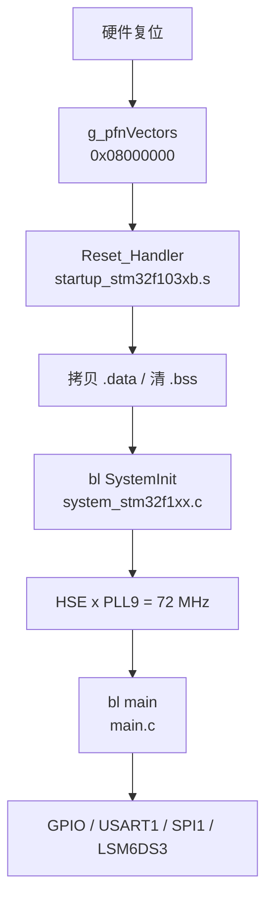

# f103-manual-reg 模块

**STM32F103C8T6** 核心板 demo：**PC13 LED** + **USART1 printf** + **SPI1 LSM6DS3 六轴轮询**，纯寄存器实现；LED 行为对齐厂商例程 `vendor-pack/.../核心板测试程序(PC13闪烁)`。

## 模块定位

| 项 | 说明 |
|----|------|
| 目标芯片 | STM32F103C8T6（Cortex-M3，Medium-density F103xB，64 KB Flash / 20 KB RAM） |
| 实现方式 | 全手写 `startup` / `system_stm32f1xx.c` / GPIO·USART·SPI 寄存器，**不链接** CMSIS submodule 与 HAL |
| 应用功能 | PC13 闪烁（位带 `PCout`）；USART1 @ PA9/PA10，1500000 bps，`printf` → 串口；SPI1 → LSM6DS3（WHO_AM_I + raw 六轴） |
| 标准库 | 工具链 **newlib**（`libc.a`）+ 工程内 [`syscalls.c`](../../projects/f103-manual-reg/src/syscalls.c) 重定向 `_write` |
| 对照工程 | [`f103-cmsis-hal`](f103-cmsis-hal.md) — 当前阶段 HAL 工程仍以 LED+USART 为主（本轮未同步 SPI） |
| 参照关系 | vendor-pack 三层见 [ST F1 软件仓库归纳 §5](../learn/stm32-cmsis-component-repos.md#5-与-embed-dev-lab-的三层参照)；从零手写见 [从零手写构建指南](../learn/f103-manual-build-from-scratch.md) |

## 目录结构

```text
projects/f103-manual-reg/
├── CMakeLists.txt
├── CMakePresets.json
├── src/
│   ├── main.c              # GPIOC / USART1 / SPI1 / LSM6DS3 初始化与轮询
│   ├── system_stm32f1xx.c  # SystemInit，HSE→72 MHz
│   ├── system_stm32f1xx.h
│   ├── gpioc_bitband.h     # PCout(n) 位带宏
│   ├── usart.c / usart.h   # USART1 纯寄存器初始化与阻塞发送
│   ├── spi.c / spi.h       # SPI1 Mode3 + PA4 软件 CS
│   ├── lsm6ds3.c / lsm6ds3.h # LSM6DS3 寄存器读写与 raw 采样
│   └── syscalls.c          # newlib _write/_sbrk 等，printf → USART1
├── startup/
│   └── startup_stm32f103xb.s   # 向量表、.data/.bss、Reset_Handler
└── linker/
    └── STM32F103C8_FLASH.ld    # 64K Flash / 20K RAM；end/_end 堆起点
```

## 运行时初始化顺序

```text
上电/复位（硬件）
  → 读向量表 g_pfnVectors @ 0x08000000
       [0] _estack → MSP
       [1] Reset_Handler → PC
  → Reset_Handler（startup/startup_stm32f103xb.s）
       设 SP → 拷贝 .data → 清零 .bss
  → bl SystemInit（src/system_stm32f1xx.c）
       HSE 8 MHz × PLL×9 → SYSCLK 72 MHz（失败则 HSI 8 MHz）
  → bl main（src/main.c）
       1. GPIOC_Init()    — PWR+DBP、PC13 推挽输出
       2. USART1_Init()   — RCC+GPIOA+USART1，1500000 8N1
       3. SPI1_Init()     — PA5/6/7 + PA4 CS，Mode 3，DIV16
       4. 延时 ≥20 ms     — LSM6DS3 boot（见 AN4650 / electrical-spi-timing）
       5. WHO_AM_I / LSM6DS3_Init — 期望 0x69；CTRL1_XL/CTRL2_G = 0x40
       6. for(;;) 轮询 STATUS+12 字节 raw + printf + LED
```



`main` **不会**再调用 `SystemInit`。链接使用 `-nostartfiles`，无工具链 crt0；C 运行时最小初始化全在 `Reset_Handler`。
## 源码地图

| 文件 | 职责 | 延伸阅读 |
|------|------|----------|
| [`startup/startup_stm32f103xb.s`](../../projects/f103-manual-reg/startup/startup_stm32f103xb.s) | 向量表、`Reset_Handler`、`.data`/`.bss`、`bl SystemInit`、`bl main` | [编译流程](../learn/f103-module-build-flow.md)、[中断向量表](../learn/interrupt-vector-table-and-nvic.md) |
| [`src/system_stm32f1xx.c`](../../projects/f103-manual-reg/src/system_stm32f1xx.c) | `SystemInit()`：HSE×PLL→72 MHz；失败保持 HSI 8 MHz | [裸机 Q11/Q12](../learn/stm32-bare-metal-bootstrap.md#q11systeminit-是怎么调用的)、[RCC/HSE](../reference/stm32f103/md/topics/rcc-clock-hse-pll.md) |
| [`src/main.c`](../../projects/f103-manual-reg/src/main.c) | 应用入口：PC13、USART1、SPI/LSM6DS3、printf | [MMIO 与 PC13](../learn/stm32f103-mmio-basics.md)、[Backup 域 PC13](../reference/stm32f103/md/topics/backup-domain-pc13.md) |
| [`src/usart.c`](../../projects/f103-manual-reg/src/usart.c) | USART1 MMIO：PA9 TX / PA10 RX，BRR/UE/TE，阻塞写 DR | 下文 § USART1 与 § printf |
| [`src/spi.c`](../../projects/f103-manual-reg/src/spi.c) | SPI1 Mode3、软件 CS(PA4)、阻塞交换字节 | [SPI 时序](../reference/lsm6ds3/md/topics/electrical-spi-timing.md) |
| [`src/lsm6ds3.c`](../../projects/f103-manual-reg/src/lsm6ds3.c) | WHO_AM_I、CTRL、STATUS、连读 OUT 12 字节 | [SPI 协议](../reference/lsm6ds3/md/topics/spi-protocol.md)、[寄存器](../reference/lsm6ds3/md/topics/registers-whoami-imu.md) |
| [`src/syscalls.c`](../../projects/f103-manual-reg/src/syscalls.c) | newlib 底层 I/O；`_write`→串口，`_sbrk`→堆 | 下文 § printf 与 newlib syscall |
| [`src/gpioc_bitband.h`](../../projects/f103-manual-reg/src/gpioc_bitband.h) | `PCout(n)` 位带写 ODR | [MMIO §5](../learn/stm32f103-mmio-basics.md#5-f103-manual-reg-pc13-点灯完整-mmio-流程) |
| [`linker/STM32F103C8_FLASH.ld`](../../projects/f103-manual-reg/linker/STM32F103C8_FLASH.ld) | Flash/RAM 布局；`end`/`_ebss` 供 printf 堆 | [linker-vma-lma](../learn/linker-vma-lma.md)、[memory-map](../reference/stm32f103/md/topics/memory-map-medium-density.md) |

头文件 `usart.h`、`spi.h`、`lsm6ds3.h`、`gpioc_bitband.h`、`system_stm32f1xx.h` 由 `#include` 引入，**不**列入 CMake `SOURCES`。

## 构建与烧录

```bash
./scripts/build.sh f103-manual-reg          # configure + build
./scripts/build.sh f103-manual-reg build
./scripts/build.sh f103-manual-reg flash
./scripts/build-flash.sh                    # 默认即 f103-manual-reg；一键 build + flash
./scripts/build-flash.sh f103-manual-reg
```

产物（`projects/f103-manual-reg/build/`）：

| 文件 | 用途 |
|------|------|
| `f103-manual-reg.elf` | probe-rs / IDE F5 烧录 |
| `f103-manual-reg.hex` | POST_BUILD objcopy；OpenOCD |
| `f103-manual-reg.map` | 链接 map；含 libc 与工程符号 |

probe-rs chip：**`STM32F103C8Tx`**

### 体积参考（含 newlib / 串口）

Debug 构建下：源码写 `printf("...")` 时，GCC 常将**纯字符串**优化为 `puts()`，实测 `.text` 约 **8 KB**（`arm-none-eabi-size`）。引入带格式符的 `printf("%d", x)` 后才会链接更多 libc，接近 **30 KB** 量级。C8 64 KB Flash 仍足够本 demo；新增功能时注意 map 中 `.text` 总量。

工具链链接：`--specs=nosys.specs -nostartfiles`（[`toolchain-arm-none-eabi.cmake`](../../cmake/toolchain-arm-none-eabi.cmake)）。详见 [编译流程](../learn/f103-module-build-flow.md)。

## 启动与时钟

本工程启动链：

| 步骤 | 文件 / 符号 | 做什么 |
|------|-------------|--------|
| 1 | 硬件读 [`g_pfnVectors`](../../projects/f103-manual-reg/startup/startup_stm32f103xb.s) | `[0]=_estack` → MSP；`[1]=Reset_Handler` → PC |
| 2 | [`Reset_Handler`](../../projects/f103-manual-reg/startup/startup_stm32f103xb.s) | 设 SP；`.data` Flash→RAM；`.bss` 清零 |
| 3 | `bl SystemInit` → [`system_stm32f1xx.c`](../../projects/f103-manual-reg/src/system_stm32f1xx.c) | RCC 默认化 + `SetSysClockTo72()` |
| 4 | `bl main` → [`main.c`](../../projects/f103-manual-reg/src/main.c) | LED / USART1 / SPI1 LSM6DS3 |

[`SystemInit`](../../projects/f103-manual-reg/src/system_stm32f1xx.c)：**HSE 8 MHz × PLL×9 → SYSCLK 72 MHz**；HSE 失败保持 **HSI 8 MHz**。成功时 **APB2=PCLK2=72 MHz**（USART1 BRR、SPI1 分频均按此假定）；APB1=36 MHz。

延伸阅读：[裸机 Q11 SystemInit 调用](../learn/stm32-bare-metal-bootstrap.md#q11systeminit-是怎么调用的) · [内存映射与启动](../learn/stm32f103-memory-boot-map.md) · [VMA/LMA 与 .data/.bss](../learn/linker-vma-lma.md) · [RCC/HSE](../reference/stm32f103/md/topics/rcc-clock-hse-pll.md)
## PC13 与 Backup 域

PC13 属 **Backup 域**，须先 `RCC_APB1ENR.PWREN` + `PWR_CR.DBP`，再配置 `GPIOC_CRH`。见 [`main.c`](../../projects/f103-manual-reg/src/main.c) 中 `GPIOC_Init()`。

[Backup 域与 PC13](../reference/stm32f103/md/topics/backup-domain-pc13.md)

## LED 极性与主循环

多数核心板 **灌电流、低电平点亮**（拓扑与限流见 [gpio-led-source-sink.md](../learn/gpio-led-source-sink.md)）：

| `PCout(13)` | LED |
|-------------|-----|
| 1 | 灭 |
| 0 | 亮 |

主循环：有新 IMU 样本则 `printf` 一行 `xl … g …`；每隔若干次循环翻转 LED。

## SPI1 与 LSM6DS3

| 项 | 说明 |
|----|------|
| 外设 | SPI1（APB2），默认映射，软件 NSS |
| 模式 | Mode 3（CPOL=1，CPHA=1）；BR=DIV16 → ≈4.5 MHz |
| WHO_AM_I | 期望 `0x69`（LSM6DS3 / LSM6DS3TR；TR-C 为 `0x6A`） |
| 配置 | `CTRL1_XL=0x40`、`CTRL2_G=0x40`（104 Hz，±2 g / 250 dps） |
| 手册精选 | [doc/reference/lsm6ds3/](../reference/lsm6ds3/README.md) |
| 板级接线 | [硬件外设](../hardware/stm32f103-peripherals.md)；源码表见 [`spi.c`](../../projects/f103-manual-reg/src/spi.c) 头注释 |

### 软 SPI vs 硬件 SPI（本工程）

物理上都是标准 **4 线**（SCK / MOSI / MISO / CS）。差别在**谁产生时序**：

| 做法 | 软件做什么 | 谁移位 / 打 SCK |
|------|------------|-----------------|
| **软 SPI**（GPIO 模拟） | 自己翻 GPIO：拉 CS → 位写 MOSI、翻 SCK、读 MISO | CPU 循环（bit-bang） |
| **硬件 SPI**（本仓库） | 配 `CR1`；写 `DR` 发字节；读 `SR`/`DR` 收；GPIO 拉 CS | 片内 **SPI1** 外设 |

`spi.c` 走硬件 SPI：PA5/6/7 复用到 SPI1，PA4 仍是普通 GPIO 片选。习惯「直接操作四根线」时，那是软 SPI 视角；这里软件入口换成寄存器，线上仍是那四根。

### 信号线 vs 片内寄存器（勿混名）

标准 **4 线 SPI** 指杜邦线上的信号；`spi.c` 里的 `CR1` / `SR` / `DR` 是 **MCU SPI1 外设的 MMIO**（RM0008 正式名），与 USART 的 `SR`/`DR` 同类，**不是** SCK/MOSI 的别名。

| 层 | 名字 | 作用 |
|----|------|------|
| 板级信号 | SCK、MOSI、MISO、CS | 时钟 / 主机出 / 主机入 / 片选（本工程 CS=GPIO PA4） |
| 片内寄存器 | `SPI1_CR1` | Control Register 1：主从、CPOL/CPHA、分频、SPE |
| 片内寄存器 | `SPI1_SR` | Status Register：`TXE` / `RXNE` |
| 片内寄存器 | `SPI1_DR` | Data Register：写→经 MOSI 发出；读←经 MISO 收到 |

软件写 `CR1`/`DR`、读 `SR` → SPI 硬件再驱动 SCK/MOSI/MISO；详细注释见 [`spi.c`](../../projects/f103-manual-reg/src/spi.c) 文件头。

### 模块丝印 ↔ MCU 引脚

| 模块丝印 | MCU | 方向 / 说明 |
|----------|-----|-------------|
| `3V3` | 面包板 3.3V 轨（ST-Link 3.3V） | 供电（**勿接 VIN** / 勿接蓝板电源） |
| `GND` | 面包板 GND 轨 | 与 ST-Link / CH341 / 蓝板 SWD 星型共地 |
| `SCL` | PA5 | ← SPI1_SCK |
| `SDA` | PA7 | ← SPI1_MOSI（SDI） |
| `SAO` | PA6 | → SPI1_MISO（SDO） |
| `CS` | PA4 | ← GPIO 软件片选（低有效） |
| INT1 / INT2 / OCS / SCX / SDX | — | 本 demo 不接 |

## USART1 与硬件接线

| 项 | 说明 |
|----|-----|
| 外设 | USART1（APB2，PCLK2 作波特率时钟） |
| 引脚 | PA9=TX，PA10=RX（F103 默认映射，无 AFIO 重映射） |
| 帧格式 | 1500000 bps，8N1 |
| CH341 | 模块 **RX←PA9**，**TX→PA10**，**GND→面包板 GND 轨** |
| Windows ↔ WSL | `./scripts/serial-ch341-switch.sh status\|to-win\|to-wsl`；WSL 读串口：`picocom -b 1500000 /dev/ttyUSB0`（见 [scripts-reference § picocom](../scripts-reference.md#wsl-下用-picocom-读串口1500000-8n1)） |
| 实现 | [`usart.c`](../../projects/f103-manual-reg/src/usart.c) 写 RCC/GPIOA/USART1 寄存器；`USART1_Write` 轮询 `SR.TXE` 写 `DR` |

## printf 与 newlib syscall

### 调用链

```text
printf / vfprintf     → libc.a（工具链，不在本仓库）
stdio → _write_r()      → libc.a
_write()                → src/syscalls.c（本工程，强符号）
USART1_Write()          → src/usart.c（写 USART1_DR，硬件自动发串行帧）
```

### 与 libnosys 的关系（链接期替换，非 weak 覆盖）

`--specs=nosys.specs` 引入 **libnosys.a** 默认 `_write` / `_sbrk` 桩（`nm` 为 **T** 强符号，非 **W** weak）。

本工程 [`syscalls.c`](../../projects/f103-manual-reg/src/syscalls.c) 提供同名实现；链接时 `.obj` 先满足符号，**不再**从 libnosys 拉入占位桩。机制是 **链接期符号解析**，不是 `__attribute__((weak))` 覆盖。

[`f103-cmsis-hal`](f103-cmsis-hal.md) **不用** `printf`，见 [裸机 newlib 与串口输出 §5](../learn/newlib-nosys-stdio-retarget.md#5-printf-与-hal_uart_transmit-如何选)。

### 为何 libc 没有自带「能用的」`_write`

newlib 跨平台，无法在库内假定 USART 引脚/波特率；`nosys` 只给占位桩。详见 [learn §2](../learn/newlib-nosys-stdio-retarget.md#2-为什么标准-c-库没有能用的_write)。

### 堆与链接脚本

`printf` 可能触发 newlib 堆分配。链接脚本在 `.bss` 后导出 `end`/`_end`（与 `_ebss` 同址）；[`syscalls.c`](../../projects/f103-manual-reg/src/syscalls.c) 中 `_sbrk` 以 `_ebss` 为堆起点，上限距 `_estack` 留 512 字节。

### 换行

Windows 串口助手需 **CRLF**。[`syscalls.c`](../../projects/f103-manual-reg/src/syscalls.c) 的 `_write` 在 `\n` 前自动补 `\r`；`main.c` 中字符串只需 `\n`。

概念总览：[裸机 newlib、nosys 与串口输出](../learn/newlib-nosys-stdio-retarget.md)

## CMSIS 对照路径

本模块**不链接** CMSIS/HAL；下列路径供对照：

| 层级 | submodule 路径 |
|------|----------------|
| startup / system | `vendor-pack/cmsis-device-f1/Source/Templates/gcc/` |
| Device 头 | `vendor-pack/cmsis-device-f1/Include/stm32f103xb.h` |
| Core | `vendor-pack/cmsis-core/Include/core_cm3.h` |

`./scripts/fetch-cmsis.sh` · [CMSIS 与手写边界](../learn/cmsis-overview.md)

## 硬件参考

| 项目 | 说明 |
|------|------|
| 引脚总表 | [C8T6 丝印总表](../hardware/stm32f103c8t6-pinout.md) · [LQFP48 官方摘录](../reference/stm32f103/md/topics/lqfp48-pinout.md) |
| LED | PC13（推挽；非 FT；灌电流；[GPIO 八态](../learn/gpio-eight-modes.md)；[拉/灌](../learn/gpio-led-source-sink.md)） |
| 调试串口 | USART1：PA9 TX，PA10 RX（FT；[UART/TTL](../learn/uart-ttl-rs232-rs485.md)） |
| IMU | SPI1：PA4 CS，PA5 SCK，PA6 MISO，PA7 MOSI → LSM6DS3（PA4–PA7 **非 FT**） |
| SWD | SWDIO=PA13，SWCLK=PA14（[SWD ≠ USART](../learn/swd-vs-usart.md)） |
| 厂商例程 | `vendor-pack/STM32F103C8T6核心板/.../核心板测试程序(PC13闪烁)/` |

## 排错速查

| 现象 | 优先检查 |
|------|----------|
| LED 不闪 | PWR+DBP；先 `build` 再 `flash` |
| 程序卡死 | HSE 超时（`system_stm32f1xx.c`）；无晶振时 HSI 路径 |
| 有 LED 无串口 | `USART1_Init()`；COM/波特率 1500000/GND；CH341 宿主 `serial-ch341-switch.sh status` |
| 串口逐行右移 | `_write` 须 `\n`→`\r\n`（已实现在 `syscalls.c`） |
| WHO_AM_I=0x00/0xFF | CS、3V3、MISO=SAO、SPI Mode 3、上电 20 ms 后再读 |
| WHO_AM_I=0x6A | 模块可能是 LSM6DS3TR-C，期望 ID 不同 |
| 链接 `_write` / `end` 错误 | 是否含 `syscalls.c`；链接脚本 `PROVIDE(end)` |
| `probe-rs list` 空 | [WinUSB 脚本](../../scripts/install/stlink-winusb-windows.sh) |
| 烧录仍是旧程序 | `flash` 不自动 compile |

[PROJECT_MEMORY.md](../../PROJECT_MEMORY.md)

## 调试

- IDE：**F103 Probe-rs Debug**（`.vscode/launch.json`）
- CLI：[probe-rs.md](../probe-rs.md)

## 新增工程参考

- [从零手写构建指南](../learn/f103-manual-build-from-scratch.md)
- [应用层索引](README.md#新增工程-checklist)
