# 脚本参考

本文列出 `scripts/` 下各脚本的用途、典型命令及 **自动化链路**。脚本日志前缀为 `[embed-dev-lab]`，输出为英文。

## 自动化总览

```mermaid
flowchart TB
    subgraph bootstrap_flow [bootstrap.sh]
        B1[install-tools.sh] --> B2[setup-path 内嵌刷新]
        B2 --> B3[install-extensions.sh 可选]
        B3 --> B4[env-check.sh --tools-only]
        B4 --> B5["build.sh f103-blink"]
        B5 --> B6[setup-clangd.sh]
    end

    subgraph cli_flash [CLI 烧录]
        C1["build.sh build"] --> C2["build.sh flash"]
    end

    subgraph ide_flow [IDE F5 调试]
        I1[Task Build F103] --> I2[build.sh f103-blink]
        I2 --> I3[probe-rs-debugger flash+debug]
    end
```



---

## 入口脚本

### bootstrap.sh — 一键环境 + 编译

**不含烧录。**

```bash
./scripts/bootstrap.sh                    # 安装 + 扩展 + 编译 f103-blink + clangd
./scripts/bootstrap.sh --build-only       # 跳过安装，仅 PATH + 编译
./scripts/bootstrap.sh --install-only     # 仅安装，不编译
./scripts/bootstrap.sh --skip-extensions  # 不装 IDE 扩展
./scripts/bootstrap.sh --module other     # 指定模块（默认 f103-blink）
./scripts/bootstrap.sh --no-proxy         # 禁用默认代理 7890
```

步骤顺序：安装工具 → 刷新 PATH →（扩展）→ env-check → build → setup-clangd。

---

### build.sh — 模块构建与烧录

```bash
./scripts/build.sh <module> [action]
```

| action | 行为 |
|--------|------|
| `all`（默认） | configure + build + sync compile_commands + clangd |
| `configure` | 仅 CMake configure |
| `build` | 仅 ninja build |
| `flash` | probe-rs download + reset（**不编译**） |
| `flash-openocd` | OpenOCD 烧录 hex |
| `clean` | 删除 build/ 与根 compile_commands.json |

示例：

```bash
./scripts/build.sh f103-blink
./scripts/build.sh f103-blink build
./scripts/build.sh f103-blink flash
./scripts/build.sh f103-blink build && ./scripts/build.sh f103-blink flash
```

F103 chip：`STM32F103C8Tx`。ELF：`modules/<module>/build/<module>.elf`。

---

### install-tools.sh — 分 OS 安装

```bash
./scripts/install-tools.sh
./scripts/install-tools.sh --skip-extensions
./scripts/install-tools.sh --skip-env-check
```

调用 `scripts/install/{windows,linux,macos}.sh`，末尾可选 setup-path、扩展、env-check。

---

## 辅助脚本

| 脚本 | 用途 | 典型命令 |
|------|------|----------|
| `env-check.sh` | 校验 cmake/ninja/gcc/clangd/probe-rs、扩展、probe | `./scripts/env-check.sh` |
| `setup-path.sh` | 写入 User PATH + `~/.bashrc` embed-dev-lab 块 | `./scripts/setup-path.sh` |
| `setup-clangd.sh` | 同步 compile_commands、写 settings.local.json | `./scripts/setup-clangd.sh` |
| `install-extensions.sh` | 安装 `.vscode/extensions.json` 扩展 | `./scripts/install-extensions.sh` |
| `install/stlink-winusb-windows.sh` | Windows ST-Link WinUSB | `--check-only` / `--install` |

---

## env-check.sh 选项

```bash
./scripts/env-check.sh              # 工具 + 扩展 + probe（Windows）
./scripts/env-check.sh --tools-only # 仅 CLI 工具（bootstrap 内部用）
```

---

## lib/ 公共库

| 文件 | 作用 |
|------|------|
| `lib/common.sh` | 日志、`die`、工具检测 |
| `lib/os-detect.sh` | OS 判定、Git Bash 要求 |
| `lib/paths.sh` | 路径规范化、用户目录 |
| `lib/path-setup.sh` | PATH 写入 Windows/macOS/Linux |
| `lib/detect-toolchain.sh` | ARM GCC 探测 |
| `lib/proxy.sh` | 代理（默认 `http://127.0.0.1:7890`） |
| `lib/editor-detect.sh` | cursor/code CLI |

---

## 如何「自动」编译与烧录

| 目标 | 做法 |
|------|------|
| 自动装环境 + **编译** | `./scripts/bootstrap.sh` |
| CLI **编译 + 烧录** | `build.sh f103-blink build && build.sh f103-blink flash` |
| Task **编译 + 烧录** | Run Task → **Build and Flash F103** |
| IDE **编译 + 烧录 + 调试** | F5 → **F103 Probe-rs Debug** |

---

## 运行环境要求

- **Windows**：必须在 **Git Bash** 中执行（`scripts/lib/os-detect.sh` 强制）
- **Linux / macOS**：bash 4+

---

### fetch-stm32f103-docs.sh — ST 官方文档下载

下载 **DS5319** Datasheet 与 **RM0008** Reference Manual 至 `doc/reference/stm32f103/pdf/`。  
**ST 官网无需注册**；若 curl 超时，可用浏览器打开直链保存 PDF 后 `--verify-only` 校验。

```bash
./scripts/fetch-stm32f103-docs.sh
./scripts/fetch-stm32f103-docs.sh --verify-only
./scripts/fetch-stm32f103-docs.sh --force
./scripts/fetch-stm32f103-docs.sh --no-proxy
```

- 优先 ST 直链；RM0008 失败时尝试 Keil 镜像  
- SHA256 写入 `doc/reference/stm32f103/checksums.sha256`  
- 精选 MD 见 [reference/stm32f103/md/](reference/stm32f103/md/)

---

### install-mcp-skills.sh — MCP 与项目 Skill

安装 **embedded-debugger-mcp**（cargo 构建 + probe-rs）与 **embed-dev-lab** Skill。详见 [mcp-skills.md](mcp-skills.md)。

```bash
./scripts/install-mcp-skills.sh
./scripts/install-mcp-skills.sh --global
./scripts/install-mcp-skills.sh --verify-only
./scripts/bootstrap.sh --with-mcp    # bootstrap 可选步骤
```

---

## 相关文档

- [快速上手](getting-started.md)
- [probe-rs](probe-rs.md)
- [IDE 调试](ide-debug.md)
