# 脚本参考

本文列出 `scripts/` 下各脚本的用途、典型命令及 **自动化链路**。脚本日志前缀为 `[embed-dev-lab]`，输出为英文。

## 自动化总览

```mermaid
flowchart TB
    subgraph bootstrap_flow [bootstrap.sh]
        B1[install-tools.sh] --> B2[setup-path 内嵌刷新]
        B2 --> B3[install-extensions.sh 可选]
        B3 --> B4[env-check.sh --tools-only]
        B4 --> B5["build.sh f103-manual-reg"]
        B5 --> B6[setup-clangd.sh]
    end

    subgraph cli_flash [CLI 烧录]
        C1["build.sh build"] --> C2["build.sh flash"]
    end

    subgraph ide_flow [IDE F5 调试]
        I1[Task Build F103] --> I2[build.sh f103-manual-reg]
        I2 --> I3[probe-rs-debugger flash+debug]
    end
```



---

## 入口脚本

### bootstrap.sh — 一键环境 + 编译

**不含烧录。**

```bash
./scripts/bootstrap.sh                    # 安装 + 扩展 + 编译 f103-manual-reg + clangd
./scripts/bootstrap.sh --build-only       # 跳过安装，仅 PATH + 编译
./scripts/bootstrap.sh --install-only     # 仅安装，不编译
./scripts/bootstrap.sh --skip-extensions  # 不装 IDE 扩展
./scripts/bootstrap.sh --module other     # 指定模块（默认 f103-manual-reg）
./scripts/bootstrap.sh --no-proxy         # 禁用默认代理 7890
```

步骤顺序：安装工具 → 刷新 PATH →（扩展）→ env-check → build → setup-clangd。

---

### build.sh — 模块构建与烧录

```bash
./scripts/build.sh <module> [action]
```

| action | 行为 |
|--------|------|
| `all`（默认） | configure + build + sync compile_commands + clangd |
| `configure` | 仅 CMake configure |
| `build` | 仅 ninja build |
| `flash` | probe-rs download + reset（**不编译**） |
| `flash-openocd` | OpenOCD 烧录 hex |
| `clean` | 删除 build/ 与根 compile_commands.json |

示例：

```bash
./scripts/build.sh f103-manual-reg
./scripts/build.sh f103-manual-reg build
./scripts/build.sh f103-manual-reg flash
./scripts/build.sh f103-manual-reg build && ./scripts/build.sh f103-manual-reg flash
./scripts/build-flash.sh f103-manual-reg   # 同上；编译失败时暂停
./scripts/build-flash.sh f103-cmsis-hal
```

---

### build-flash.sh — 一键编译并烧录

依次执行 `build.sh build` → `build.sh flash`。编译失败时 **ninja/gcc 报错原样输出**，并在交互终端 **暂停等待 Enter**。

```bash
./scripts/build-flash.sh              # 默认 f103-manual-reg
./scripts/build-flash.sh f103-manual-reg
./scripts/build-flash.sh f103-cmsis-hal
```

| 步骤 | 行为 |
|------|------|
| build 失败 | 打印编译错误，`Press Enter to exit...`，exit 1 |
| build 成功 | probe-rs download + reset |

---

F103 chip：`STM32F103C8Tx`。ELF：`projects/<project>/build/<project>.elf`。

#### 构建产物与格式转换

工具链为 **`arm-none-eabi-gcc`**（裸机），非 `arm-linux-gnueabihf`。

| 文件 | 生成时机 | 用途 |
|------|----------|------|
| `<module>.elf` | Ninja 链接 | probe-rs `flash`、IDE F5 |
| `<module>.hex` | build 后 POST_BUILD（[`mcu-config.cmake`](../cmake/mcu-config.cmake) 内 `arm-none-eabi-objcopy -O ihex`） | `flash-openocd` |
| `<module>.bin` | **未生成** | — |

```text
build  → .elf + .hex（objcopy 自动）
flash  → probe-rs 烧录 .elf
flash-openocd → OpenOCD 烧录 .hex
```

CMake / 链接细节见 [f103-manual-reg 编译流程](learn/f103-module-build-flow.md)。

---

### install-tools.sh — 分 OS 安装

```bash
./scripts/install-tools.sh
./scripts/install-tools.sh --skip-extensions
./scripts/install-tools.sh --skip-env-check
```

调用 `scripts/install/{windows,linux,macos}.sh`，末尾可选 setup-path、扩展、env-check。

---

## 辅助脚本

| 脚本 | 用途 | 典型命令 |
|------|------|----------|
| `env-check.sh` | 校验 cmake/ninja/gcc/clangd/probe-rs、扩展、probe | `./scripts/env-check.sh` |
| `setup-path.sh` | 写入 User PATH + `~/.bashrc` embed-dev-lab 块 | `./scripts/setup-path.sh` |
| `setup-clangd.sh` | 同步 compile_commands、写 settings.local.json | `./scripts/setup-clangd.sh` |
| `install-extensions.sh` | 安装 `.vscode/extensions.json` 扩展 | `./scripts/install-extensions.sh` |
| `install/stlink-winusb-windows.sh` | Windows ST-Link WinUSB | `--check-only` / `--install` |

---

## env-check.sh 选项

```bash
./scripts/env-check.sh              # 工具 + 扩展 + probe（Windows）
./scripts/env-check.sh --tools-only # 仅 CLI 工具（bootstrap 内部用）
```

---

## lib/ 公共库

| 文件 | 作用 |
|------|------|
| `lib/common.sh` | 日志、`die`、工具检测 |
| `lib/os-detect.sh` | OS 判定、Git Bash 要求 |
| `lib/paths.sh` | 路径规范化、用户目录 |
| `lib/path-setup.sh` | PATH 写入 Windows/macOS/Linux |
| `lib/detect-toolchain.sh` | ARM GCC 探测 |
| `lib/proxy.sh` | 代理（默认 `http://127.0.0.1:7890`） |
| `lib/editor-detect.sh` | cursor/code CLI |

---

## 如何「自动」编译与烧录

| 目标 | 做法 |
|------|------|
| 自动装环境 + **编译** | `./scripts/bootstrap.sh` |
| CLI **编译 + 烧录** | `build.sh f103-manual-reg build && build.sh f103-manual-reg flash` |
| Task **编译 + 烧录** | Run Task → **Build and Flash F103** |
| IDE **编译 + 烧录 + 调试** | F5 → **F103 Probe-rs Debug** 或 **F103 CMSIS-HAL Probe-rs Debug** |

---

## 运行环境要求

- **Windows**：必须在 **Git Bash** 中执行（`scripts/lib/os-detect.sh` 强制）
- **Linux / macOS**：bash 4+

---

### fetch-stm32f103-docs.sh — ST 官方文档下载

下载 **DS5319** Datasheet 与 **RM0008** Reference Manual 至 `doc/reference/stm32f103/pdf/`。  
**ST 官网无需注册**；若 curl 超时，可用浏览器打开直链保存 PDF 后 `--verify-only` 校验。

```bash
./scripts/fetch-stm32f103-docs.sh
./scripts/fetch-stm32f103-docs.sh --verify-only
./scripts/fetch-stm32f103-docs.sh --force
./scripts/fetch-stm32f103-docs.sh --no-proxy
```

- 优先 ST 直链；RM0008 失败时尝试 Keil 镜像  
- SHA256 写入 `doc/reference/stm32f103/checksums.sha256`  
- 精选 MD 见 [reference/stm32f103/md/](reference/stm32f103/md/)

---

### fetch-cmsis.sh — CMSIS 子模块（Core + Device F1）

初始化或更新 ST CMSIS **git submodules**：

| 路径 | Tag | 层 |
|------|-----|-----|
| `vendor-pack/cmsis-core/` | 分支 `cm3` · `v5.6.0_cm3` | CMSIS-Core（Cortex-M3，F103C8T6） |
| `vendor-pack/cmsis-device-f1/` | `v4.3.5` | CMSIS-Device F1（F103xB） |

```bash
git clone --recursive <repo-url>
./scripts/fetch-cmsis.sh
./scripts/fetch-cmsis.sh --verify-only
```

- 验证：Core `Include/core_cm3.h`；Device `Include/stm32f103xb.h`、`Source/Templates/gcc/startup_stm32f103xb.s`、`Source/Templates/system_stm32f1xx.c`
- 说明：[cmsis-core.embed-dev-lab.md](../vendor-pack/cmsis-core.embed-dev-lab.md)、[cmsis-device-f1.embed-dev-lab.md](../vendor-pack/cmsis-device-f1.embed-dev-lab.md)
- 组件归纳：[doc/learn/stm32-cmsis-component-repos.md](learn/stm32-cmsis-component-repos.md)
- 兼容：`fetch-cmsis-core.sh` 为同脚本的别名入口

---

### fetch-f103-cmsis-hal-deps.sh — f103-cmsis-hal 最小 CMSIS/HAL

从 `vendor-pack` CMSIS submodule 与 HAL ref（`stm32f1xx-hal-driver@v1.1.8`，clone 至 `.tools/`）拷贝 PC13 闪烁所需最小子集至 `projects/f103-cmsis-hal/third_party/`，并拷贝 CMSIS `startup` / `system` / `STM32F103XB_FLASH.ld`（C8 64K 裁剪）。

```bash
./scripts/fetch-cmsis.sh
./scripts/fetch-f103-cmsis-hal-deps.sh
./scripts/fetch-f103-cmsis-hal-deps.sh --verify-only
```

构建：`./scripts/build.sh f103-cmsis-hal`。说明见 [doc/projects/f103-cmsis-hal.md](projects/f103-cmsis-hal.md)。

---

### fetch-stm32cubef1.sh — STM32CubeF1 固件包

获取 ST [**STM32CubeF1**](https://github.com/STMicroelectronics/STM32CubeF1) MCU Package（CMSIS/HAL/Middleware/例程）至 `vendor-pack/STM32CubeF1/`。  
HAL 独立上游：[stm32f1xx-hal-driver](https://github.com/STMicroelectronics/stm32f1xx-hal-driver)（见 [`stm32f1xx-hal-driver.embed-dev-lab.md`](../vendor-pack/stm32f1xx-hal-driver.embed-dev-lab.md)）。  
GitHub「Download ZIP」不含 submodule；请用 **ST 官网 ZIP** 或脚本的 **`--clone`**。

```bash
./scripts/fetch-stm32cubef1.sh
./scripts/fetch-stm32cubef1.sh --from-zip vendor-pack/STM32CubeF1/archives/STM32CubeF1-1.8.6.zip
./scripts/fetch-stm32cubef1.sh --clone
./scripts/fetch-stm32cubef1.sh --verify-only
./scripts/fetch-stm32cubef1.sh --force
```

- 默认：若 `archives/*.zip` 存在则解压，否则 `git clone --recursive` v1.8.6  
- 验证：`Drivers/CMSIS/.../startup_stm32f103xb.s` 与 `system_stm32f1xx.c`（旧版为 `system_stm32f1xx.c`）  
- 详见 [vendor-pack/STM32CubeF1/README.md](../vendor-pack/STM32CubeF1/README.md)

---

### install-mcp-skills.sh — MCP 与项目 Skill

安装 **embedded-debugger-mcp**（cargo 构建 + probe-rs）与 **embed-dev-lab** Skill。详见 [mcp-skills.md](mcp-skills.md)。

```bash
./scripts/install-mcp-skills.sh
./scripts/install-mcp-skills.sh --global
./scripts/install-mcp-skills.sh --verify-only
./scripts/bootstrap.sh --with-mcp    # bootstrap 可选步骤
```

---

## 相关文档

- [快速上手](getting-started.md)
- [probe-rs](probe-rs.md)
- [IDE 调试](ide-debug.md)
