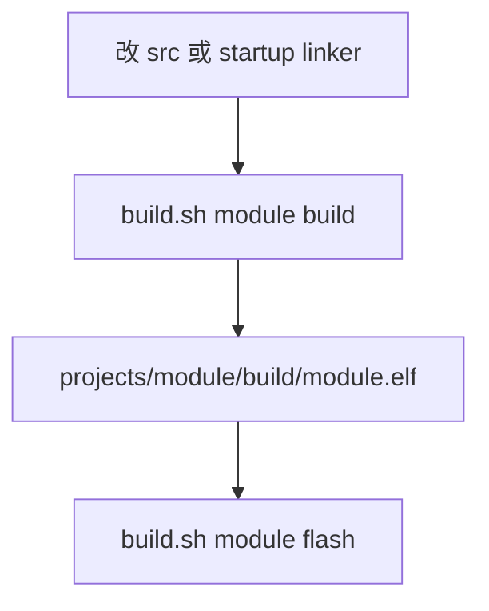

# 编写 → 编译 → 下载

本页是 **编写、编译、烧录** 的唯一流程说明。CLI 输出为英文。Windows 须在 **Git Bash** 中运行脚本。

相关：[`getting-started.md`](getting-started.md)（从零环境）、[`scripts-reference.md`](scripts-reference.md)（脚本全表）、[`probe-rs.md`](probe-rs.md)。

## 烧写脚本在哪里

烧写入口都在仓库根目录 [`scripts/`](../scripts/)，核心是两处：

| 文件 | 作用 |
|------|------|
| [`scripts/build.sh`](../scripts/build.sh) | **真正烧录**：`flash` → `probe-rs download --chip STM32F103C8Tx --binary-format elf`，再 `probe-rs reset`；备选 `flash-openocd` 烧 `.hex` |
| [`scripts/build-flash.sh`](../scripts/build-flash.sh) | **一键包装**：先 `build.sh … build`，再 `build.sh … flash`（**不** configure） |

常用命令：

```bash
./scripts/build.sh f103-manual-reg flash
./scripts/build-flash.sh f103-manual-reg
./scripts/build-flash.sh f103-cmsis-hal
```

**IDE**（同样落到上述脚本或 probe-rs）：

| 入口 | 路径 |
|------|------|
| Task「Build and Flash F103」等 | [`.vscode/tasks.json`](../.vscode/tasks.json) |
| F5 调试烧录（`flashingEnabled`） | [`.vscode/launch.json`](../.vscode/launch.json) |

[`bootstrap.sh`](../scripts/bootstrap.sh) **不含**烧录，只装环境并编译。脚本全表见 [`scripts-reference.md`](scripts-reference.md)。

## 总览



| 模块 | 首次依赖 | 日常命令前缀 |
|------|----------|--------------|
| `f103-manual-reg` | 无 CMSIS/HAL fetch | `./scripts/build.sh f103-manual-reg` |
| `f103-cmsis-hal` | `./scripts/fetch-cmsis.sh` → `./scripts/fetch-f103-cmsis-hal-deps.sh` | `./scripts/build.sh f103-cmsis-hal` |

probe-rs chip：`STM32F103C8Tx`。烧录格式：`--binary-format elf`。

## 场景 A：首次 / `clean` 之后

`build-flash.sh` 与 `build.sh … build` **不**执行 configure。`build/` 不存在时须先：

```bash
./scripts/build.sh <module>          # configure + build（默认 all）
./scripts/build.sh <module> flash
```

`f103-cmsis-hal` 首次还须：

```bash
./scripts/fetch-cmsis.sh
./scripts/fetch-f103-cmsis-hal-deps.sh
./scripts/build.sh f103-cmsis-hal
./scripts/build.sh f103-cmsis-hal flash
```

## 场景 B：日常改代码 → 烧录

```bash
./scripts/build.sh <module> build && ./scripts/build.sh <module> flash
# 或
./scripts/build-flash.sh <module>    # 默认 module = f103-manual-reg
```

`flash` **不会**自动 compile：改源码后必须先 `build`。

## 场景 C：只烧录（未改代码）

```bash
./scripts/build.sh <module> flash
```

ELF 须已存在且为最新：`projects/<module>/build/<module>.elf`。

## 场景 D：IDE

| 工程 | F5 配置 | preLaunchTask |
|------|---------|---------------|
| manual-reg | **F103 Probe-rs Debug** | Build F103 |
| cmsis-hal | **F103 CMSIS-HAL Probe-rs Debug** | Build F103 CMSIS-HAL |

详见 [`ide-debug.md`](ide-debug.md)。

## 串口验证（两工程相同）

| 项 | 值 |
|----|-----|
| 外设 | USART1，PA9=TX，PA10=RX |
| 波特率 | **1500000** 8N1 |
| USB-TTL | 模块 **RX←PA9**，TX→PA10，**GND 共地** |

串口与 SWD 独立：烧录只需 ST-Link；看日志需 USB-TTL（常见 CH341）。SWD ≠ 串口：[swd-vs-usart.md](learn/swd-vs-usart.md)；TTL vs RS232：[uart-ttl-rs232-rs485.md](learn/uart-ttl-rs232-rs485.md)。

**CH341 在 Windows / WSL 间切换**（usbipd-win）：

```bash
./scripts/serial-ch341-switch.sh status     # 当前宿主
./scripts/serial-ch341-switch.sh to-win     # Windows COM → 串口助手 1500000 8N1
./scripts/serial-ch341-switch.sh to-wsl     # WSL /dev/ttyUSB0
```

**WSL 读日志（picocom；波特率与固件一致）：**

```bash
picocom -b 1500000 /dev/ttyUSB0          # 默认 demo；固件改波特则改 -b
```

**Windows Agent 读日志（自动 COM，勿写死端口）：**

```bash
./scripts/serial-ch341-read.sh
./scripts/serial-ch341-read.sh --baud 115200   # 固件波特已变时
```

完整选项见 [`scripts-reference.md` § serial-ch341-read / picocom](scripts-reference.md#serial-ch341-readsh--windows-agent-读串口)。宿主切换见 [serial-ch341-switch.sh](scripts-reference.md#serial-ch341-switchsh--ch341-串口宿主切换windows--wsl)。

多数核心板 PC13 **低电平点亮**。串口打印 `LED on` 时 GPIO 置高（灯灭），`LED off` 时置低（灯亮）——与厂商例程一致，见各工程 `doc/projects/`。

## 环境与代理

```bash
./scripts/bootstrap.sh                 # 装工具 + 编译（默认 manual-reg，不含烧录）
./scripts/bootstrap.sh --no-proxy      # 无本地代理 7890 时使用
./scripts/bootstrap.sh --module f103-cmsis-hal   # 须已 fetch deps
```

## 排错速查

| 现象 | 处理 |
|------|------|
| `build-flash` / `build` 报无 build 目录 | 先 `./scripts/build.sh <module>`（configure） |
| cmsis-hal 缺头文件 | `./scripts/fetch-f103-cmsis-hal-deps.sh` |
| `probe-rs list` 空 | Windows：`stlink-winusb-windows.sh --install` |
| LED 不闪 | PWR+DBP；先 build 再 flash；板载 RESET |
| 有 LED 无串口 | 波特率 1500000、RX←PA9、GND；CH341 宿主见 `serial-ch341-switch.sh status` |
| CH341 在 WSL 看不见 / Windows 无 COM | `./scripts/serial-ch341-switch.sh to-wsl` 或 `to-win`（需管理员 + usbipd-win） |
| picocom 打不开 / 乱码 | 确认 `/dev/ttyUSB0`、`-b 1500000`；dialout 组；见 scripts-reference § picocom |

维护速查：[PROJECT_MEMORY.md](../PROJECT_MEMORY.md)
